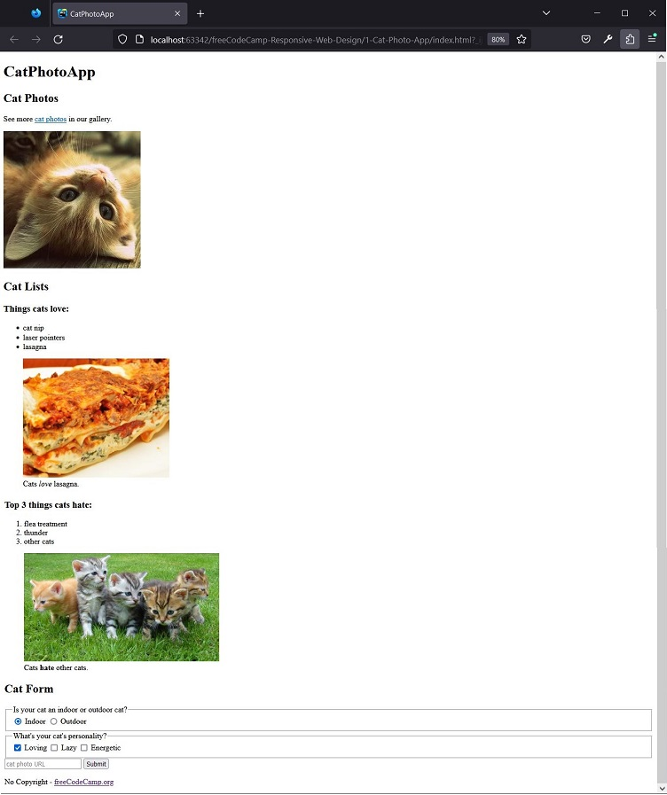

# freeCodeCamp - Responsive Web Design - Learn HTML by Building a Cat Photo App

## Result


## Steps
1. Elements in HTML have opening tags, such as `<h1>`, and closing tags, such as `</h1>`.
   The text of an element goes between the opening and closing tags.
   Find the h1 element and change its text to: `CatPhotoApp`:
   `<h1>CatPhotoApp</h1>`

2. Heading elements, ranging from h1 to h6, are used to give meaning to the importance of the content below them.
   The smaller the number, the greater the importance. Therefore, h2 elements are less important than h1 elements.
   Use only one h1 element per page and place lower-importance headings below higher-importance headings.
   Below the h1 element, add an h2 element with this text: `CatPhotoApp`:
   `<h2>Cat Photos</h2>`

3. The p element is used to create a paragraph of text on websites.
   Create a p element below the h2 element and give it the following text:`See more cat photos in our gallery.`
   `<p>See more <a target="_blank" href="https://freecatphotoapp.com">cat photos</a> in our gallery.</p>`

4. Posting comments allows you to leave messages without affecting the browser display.
   It also allows you to leave code inactive.
   An HTML comment starts with <!--, contains one or more lines of text, and ends with -->.
   For example, the comment <!-- TODO: Remove h1 --> contains the text TODO: Remove h1.
   Add a comment above the p element with this text: `TODO: Add link to cat photos`
   `<!-- TODO: Add link to cat photos -->`

5. HTML5 has some elements that identify different areas of content.
   These elements make your HTML easier to read and help with search engine optimization (SEO)
   and accessibility.
   Identify the main section of this page by adding a <main> tag before the h1 element
   and a closing </main> tag after the p element.
```
<main>
     <h1>CatPhotoApp</h1>
     <h2>Cat Photos</h2>
     <!-- TODO: Add link to cat photos -->
     <p>See more cat photos in our gallery.</p>
</main>
```

6. In the previous step, you placed the h1 and h2 elements, the comment and the p elements inside the main element.
   This is called nesting.
   Nested elements must be placed two spaces further to the right of the element in which they are nested.
   This spacing is called indentation and is used to make HTML easier to read.
   The h1 and h2 elements, as well as the comment, are indented two spaces in front of the main element in the code below.
   Use the spacebar on your keyboard to add two more spaces in front of the p element so that
   it is also indented correctly.
```
<main>
     <h1>CatPhotoApp</h1>
     <h2>Cat Photos</h2>
     <!-- TODO: Add link to cat photos -->
     <p>See more cat photos in our gallery.</p>
</main>
```

7. You can add images to a website using the img element.
   img elements have an opening tag but no closing tag.
   The tag of an element that does not need a closing tag is known as a self-closing tag.
   Add an img element below the p element. At this time, no images will be displayed in the browser.
   ``

8. Attributes in HTML are special words used within the opening tag of an element
   to control his behavior.
   The src attribute on an img element specifies the image URL (where the image is located).
   Here is an example of an img element with a src attribute pointing to the freeCodeCamp logo:
   ``
   Inside the existing img element, add a src attribute with this URL:
   `https://cdn.freecodecamp.org/curriculum/cat-photo-app/relaxing-cat.jpg`
   ``

9. All img elements must have an alt attribute.
   The text of an alt attribute is used by screen readers to improve accessibility.
   It is displayed if the image cannot be loaded.
   For example, `` has an alt attribute with the text A cat.
   Inside the img element, add an alt attribute with this text: `A cute orange cat lying on its back`
   ``

10. You can link to another page using the anchor element (a).
    For example, `<a href='https://freecodecamp.org'></a>` would link to freecodecamp.org.
    Add an anchor element after the paragraph that links to `https://freecatphotoapp.com`.
    At this time, the link will not be displayed in the preview.
    `<a href="https://freecatphotoapp.com"></a>`

11. The text of a link must be placed between the opening and closing tags of an anchor element (a).
    For example, `<a href="https://www.freecodecamp.org">click here to go to freeCodeCamp.org</a>`
    it is a link with the text click here to go to freeCodeCamp.org.
    Add the text link to cat pictures to the anchor element. It will become the link text.
    `<a href="https://freecatphotoapp.com">link to cat pictures</a>`

12. You can turn any text into a link, such as text inside a p element.
    `<p>I think <a href="https://www.freecodecamp.org">freeCodeCamp</a> is great.</p>`
    In the text of the p element, turn the words cat photos into a link by adding the opening and closing tags
    of an anchor element (a) around these words.
    Then set the href attribute value to `https://freecatphotoapp.com`
    `<p>See more <a href="https://freecatphotoapp.com">cat photos</a> in our gallery.</p>`

13. Now that you have turned the cat photos text inside the p element into a link,
    you don't need the second link below the p element.
    Delete the entire anchor element below the p element.
    `<p>See more <a href="https://freecatphotoapp.com">cat photos</a> in our gallery.</p>`

14. Add a target attribute with the value _blank to the opening tag of the anchor element (a)
    so that the link opens in a new tab.
    `<p>See more <a href="https://freecatphotoapp.com" target="_blank">cat photos</a> in our gallery.</p>`

15. In the previous steps, you used an anchor element to turn text into a link.
    Other types of content can also be turned into links by placing them within anchor element tags.
    Turn the image into a link by surrounding it with the necessary element tags.
    Use `https://freecatphotoapp.com` as the value of the anchor element's href attribute.
```
<a href="https://freecatphotoapp.com">
     
</a>
```

16. Before adding new content, you must use a section element to separate content from photos
    of cats from the rest of the content.
    Make the h2, comment, p, and anchor elements nested in a section element.
    `<section></section>`

17. It's time to add a new section. Add a second section element below the existing section element.
    `<section></section>`

18. Inside the second section element, add a new h2 element with the text `Cat Lists`.
```
<section>
     <h2>Cat Lists</h2>
</section>
```

19. When you add a smaller title element to the page, it is implied that you are starting a new subsection.
    After the last h2 element of the second section element, add an h3 element with this text: `Things cats love:`
    `<h3>Things cats love:</h3>`

20. After the h3 element with the text Things cats love:, add an unordered list element (ul).
    Please note that nothing will be displayed at this time.
    `<ul></ul>`

21. Use list item elements (li) to create items in a list.
    Here is an example of list items in an unordered list:
```
<ul>
   <li>milk</li>
   <li>cheese</li>
</ul>
```
Inside the ul element, nest three list items to display three things cats love: `cat nip`, `laser pointers`, `lasagna`.
```
<ul>
   <li>cat nip</li>
   <li>laser pointers</li>
   <li>lasagna</li>
</ul>
```

22. After the unordered list, add a new image with the src attribute value set to: `https://cdn.freecodecamp.org/curriculum/cat-photo-app/lasagna.jpg`
    Additionally, set the alt attribute value to: `A slice of lasagna on a plate.`
    ``

23. The figure element represents self-contained content and will allow you to associate an image with a caption.
    Nest the image you just added inside a figure element.
```
<figure>
     
</figure>
```

24. A figure caption element (figcaption) is used to add a caption to describe the image
    contained within the figure element. For example, `<figcaption>A cute cat</figcaption>` adds the caption A cute cat.
    After the image inside the figure element, add a figcaption element with the text set to: `Cats love lasagna.`
```
<figure>
     
     <figcaption>Cats love lasagna.</figcaption>
</figure>
```

25. Emphasize the word love in the figcaption element by encapsulating it in an em element.
    `<em>love</em>`

26. After the figure element, add another h3 element with the text: `Top 3 things cats hate:`
    `<h3>Top 3 things cats hate:</h3>`

27. The code for an ordered list (ol) is similar to that of an unordered list, but the list of items
    in an ordered list is numbered when they are displayed.
    After the last h3 element of the second section element, add an ordered list with these three list items:
    `flea treats thunder other cats`
```
<ol>
     <li>flea treatment</li>
     <li>thunder</li>
     <li>other cats</li>
</ol>
```

28. After the ordered list, add another `figure` element.
    `<figure></figure>`

29. Inside the figure element you just added, place an img element with an attribute
    src set to `https://cdn.freecodecamp.org/curriculum/cat-photo-app/cats.jpg`.
```
<figure>
     
</figure>
```

30. To improve the accessibility of the image you added,
    insert an alt attribute with the text: `Five cats looking around a field.`
```

```

31. After the last img element, add a figcaption element with the text `Cats hate other cats`.
    `<figcaption>Cats hate other cats.</figcaption>`

32. The strong element is used to indicate that some text is of great importance or urgency.
    In the figcaption you just added, indicate that hate is of great importance
    wrapping the word in a strong element.
    `<figcaption>Cats <strong>hate</strong> other cats.</figcaption>`

33. It's time to add a new section.
    Add a third section element below the existing second section element.
    `<section></section>`

34. Inside the third section element, add an h2 element with the text: `Cat Form`
    `<h2>Cat Form</h2>`

35. Now add a web form to collect user information.
    After the `Cat Form` header, add a form element.
    `<form></form>`

36. The action attribute indicates where the form data should be sent.
    For example, `<form action="/submit-url"></form>` tells the browser that the form data should
    be sent to the path `/submit-url`.
    Add an action attribute with the value `https://freecatphotoapp.com/submit-cat-photo` to the form element.
    `<form action="https://freecatphotoapp.com/submit-cat-photo"></form>`

37. The input element allows you several ways to collect data from a web form.
    Just like img elements, input elements are self-closing and do not need closing tags.
    Add an input element inside the form element.
    `<input/>`

38. There are many types of inputs that you can create using the type attribute.
    You can easily create a password field, reset button, or control to allow
    users select a file stored on the computer.
    Create a text field to take text input from a user by adding the type attribute with the value text
    for the input element.
    `<input type="text"/>`

39. For form data to be accessed from the location specified in the action attribute,
    you must give the text field a name attribute and assign it a value that represents the
    data being sent. For example, you can use the following syntax for a text field
    email address: `<input type="text" name="email">`.
    Add the name attribute with the value catphotourl to the text field.
    `<input type="text" name="catphotourl"/>`

40. Placeholder text is used to give people a hint about what type of information should be
    inserted into an input.
    For example, `<input type="text" placeholder="Email address">`.
    Add the cat photo URL placeholder to the input element.
    `<input type="text" name="catphotourl" placeholder="cat photo URL"/>`

41. To prevent a user from submitting the form when required information is missing,
    you need to add the required attribute to an input element. There is no need to define a
    value for the required attribute. Instead, just add the word required to the input element,
    making sure there is space between this attribute and the others.
    `<input type="text" name="catphotourl" placeholder="cat photo URL" required/>`

42. Use the button element to create a clickable button.
    For example, `<button>Click Here</button>` creates a button with the text Click Here.
    Add a button element with the text Submit below the input element.
    The default behavior of clicking a form button without any attributes submits the form
    to the location specified in the action attribute.
    `<button>Submit</button>`

43. Even though you added the button below the text (input) field, they appear next to each other on the page.
    This occurs because the input and button elements are inline elements, which do not appear on new lines.
    The button you added will submit the form by default.
    However, relying on the default behavior can cause confusion.
    Add the type attribute with the value submit to the button to make it clear that it is a submit button.
    `<button type="submit">Submit</button>`

44. You can use radio buttons for questions where you want the user to give just one answer among several options.
    Here is an example of a radio button with the cat option: `<input type="radio">` cat.
    Remember that input elements are self-closing.
    Before text input, add a radio button with the option set to: `Indoor`
    `<input type="radio"/> Indoor`

45. Label elements are used to help associate the text of an input element with the input element itself
    (especially for assistive technologies like screen readers).
    For example, `<label><input type="radio"> cat</label>` makes it possible for clicking the word cat to also select
    the corresponding radio button.
    Place the radio button inside a label element.
    `<label><input type="radio"/> Indoor</label>`

46. The id attribute is used to identify specific HTML elements.
    The value of each id attribute must be unique compared to the other id values for the entire page.
    Add the id attribute with the indoor value to the radio button. When elements have multiple attributes,
    the order of these attributes does not matter.
    `<label><input id="indoor" type="radio"/> Indoor</label>`

47. Create another radio button below the first one.
    Place it inside a label element with Outdoor being the label text.
    Give the radio button an id attribute with the value outdoor.
    `<label><input id="outdoor" type="radio" name="indoor-outdoor" value="outdoor"/> Outdoor</label>`

48. Note that both radio buttons can be selected at the same time.
    To make selecting one radio button automatically deselect the other,
    both buttons must have a name attribute with the same value.
    Add the name attribute with the value indoor-outdoor to the two radio buttons.
```
<label><input id="indoor" type="radio" name="indoor-outdoor"/> Indoor</label>
<label><input id="outdoor" type="radio" name="indoor-outdoor"/> Outdoor</label>
```

49. If you select the Indoor radio button and submit the form, the form data for the
    button are based on their name and value attributes. Since your radio buttons don't have a value attribute,
    the form data will include indoor-outdoor=on, which is not useful when you have multiple buttons.
    Add a value attribute to both radio buttons.
    For convenience, set the button's value attribute to the same value as the id attribute.
```
<label><input id="indoor" type="radio" name="indoor-outdoor" value="indoor" /> Indoor</label>
<label><input id="outdoor" type="radio" name="indoor-outdoor" value="outdoor"/> Outdoor</label>
```

50. The fieldset element is used to group related inputs and labels in a web form.
    Fieldset elements are block-level elements, which means they appear on a new line.
    Place the Indoor and Outdoor radio buttons inside a fieldset element and don't forget to indent the radio buttons.
```
<fieldset>
     <label><input id="indoor" type="radio" name="indoor-outdoor" value="indoor"/> Indoor</label>
     <label><input id="outdoor" type="radio" name="indoor-outdoor" value="outdoor"/> Outdoor</label>
</fieldset>
```

51. The legend element acts as a caption for the contents of the fieldset element.
    It gives users context about what they should enter in this part of the form.
    Add a legend element with the text `Is your cat an indoor or outdoor cat?` above the two radio buttons.
    `<legend>Is your cat an indoor or outdoor cat?</legend>`

52. Next, you'll add some new input elements to the form.
    Add another fieldset element directly below the existing fieldset element.
    `<fieldset></fieldset>`

53. Add a legend element with the text `What's your cat's personality?` inside the second fieldset element.
    `<legend>What's your cat's personality?</legend>`

54. Forms typically use checkboxes for questions that have more than one answer.
    For example, here we have a checkbox with the tacos option: `<input type="checkbox">` tacos.
    Below the legend element you just added, add an input element
    with the type attribute set to checkbox and give it the option: `Loving`
    `<input type="checkbox"/> Loving`

55. Add the id attribute with the value loving to the checkbox.
    `<input type="checkbox" id="loving"/> Loving`

56. There is another way to associate the text of an input element with the element itself.
    You can place text inside a label element and add a for attribute with the same value as
    the id attribute of the input element.
    Associate the Loving text with the checkbox by inserting just the Loving text in a label element
    and giving it an appropriate attribute.
    `<input id="loving" type="checkbox"/> <label for="loving">Loving</label>`

57. Add the name attribute with the value personality in the input element of the checkbox.
    Although you won't see this in the browser, doing this makes it easier for the server to process
    of the web form, especially when there are multiple checkboxes.
    `<input id="loving" type="checkbox" name="personality"> <label for="loving">Loving</label>`

58. Add another checkbox after the one you just added.
    The value of the id attribute must be lazy and the value of the name attribute must be the same as that of the last check box.
    Also add a label element to the right of the new checkbox with the text Lazy.
    Make sure to associate the label element with the new checkbox using the for attribute.
    `<input id="lazy" type="checkbox" name="personality""> <label for="lazy">Lazy</label>`

59. Add a final checkbox after the previous one with an id attribute with the value energetic.
    The name attribute must be the same as the previous check box.
    Also add a label element to the right of the new checkbox with the text Energetic.
    Make sure to associate the label element with the new checkbox.
    `<input id="energetic" type="checkbox" name="personality"> <label for="energetic">Energetic</label>`

60. Like radio buttons, the form data for selected check boxes is the name/value attribute pair.
    Although the value attribute is optional, it is best to include it with every check box or radio button on the page.
    Add a value attribute to each checkbox.
    For convenience, set the value attribute of each check box to the same value as the id attribute.
```
<input id="loving" type="checkbox" name="personality" value="loving"> <label for="loving">Loving</label>
<input id="lazy" type="checkbox" name="personality" value="lazy"> <label for="lazy">Lazy</label>
<input id="energetic" type="checkbox" name="personality" value="energetic"> <label for="energetic">Energetic</label>
```

61. For a checkbox or radio button to be selected by default, you need to add
    the checked attribute to the element.
    There is no need to define a value for the checked attribute.
    Instead, just add the word checked to the input element,
    making sure there is space between this attribute and the others.
    Make the first radio button and first checkbox selected by default.
    `<label><input id="indoor" type="radio" name="indoor-outdoor" value="indoor" checked/> Indoor</label>`
    `<input id="loving" type="checkbox" name="personality" value="loving" checked/> <label for="loving">Loving</label>`

62. Now you will add a footer section to the page.
    After the main element, add a footer element.
    `<footer></footer>`

63. Place a p element with the text `No Copyright - freeCodeCamp.org` inside the footer element.
    `<p>No Copyright - freeCodeCamp.org</p>`

64. Make the existing freeCodeCamp.org text a link by including it in an anchor element (a).
    The href attribute must be set to `https://www.freecodecamp.org.`
    `<p>No Copyright - <a href="https://www.freecodecamp.org">freeCodeCamp.org</a></p>`

65. Notice that everything you've added to the page so far is inside the body element.
    All page content elements that should be rendered on the page are inside the body element.
    However, other important information goes inside the head element.
    Add a head element above the body element.
    `<head></head>`

66. The title element determines what browsers will show in the page's title bar or tab.
    Add a title element inside the head element using the text below: `CatPhotoApp`
    `<title>CatPhotoApp</title>`

67. Notice that all the content on the page is nested in an html element.
    All other elements must be descendants (be inside) this html element.
    Add the lang attribute with the value en to the opening html tag to specify that the page language is English.
    `<html lang="en">`

68. All pages must begin with <!DOCTYPE html>.
    This special string is known as an assertion, and it guarantees that the browser will attempt to meet general industry specifications.
    Add this declaration as the first line of code.
    `<!DOCTYPE html>`

69. You can define browser behavior by adding self-closing meta elements in head.
    Here is an example: `<meta attribute="value">`
    Tell the browser to markup in multiple languages by creating a meta element as a child of the head element.
    Set the charset attribute to UTF-8.
    `<meta charset="UTF-8"/>`


## References
https://www.freecodecamp.org/learn/2022/responsive-web-design/learn-html-by-building-a-cat-photo-app/
, accessed on 10/25/2023.