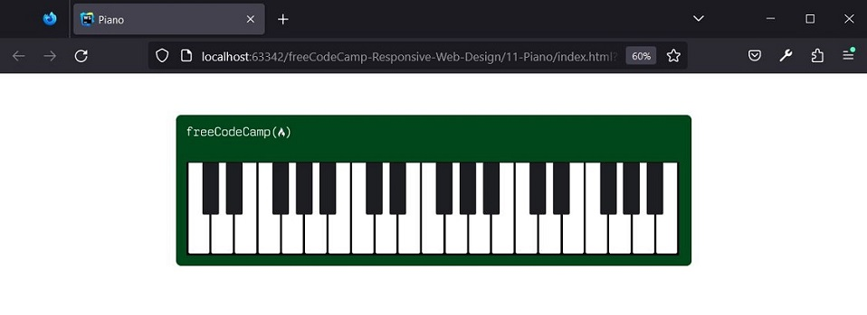
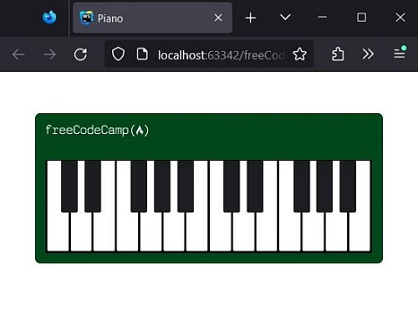
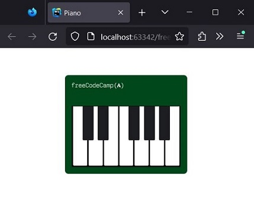

# freeCodeCamp - Design responsivo para a web - Aprenda design responsivo para a web criando um piano

## Resultado








## Passos

1. Comece com a estrutura HTML básica. 
Adicione a declaração DOCTYPE e os elementos html, head, body e title.
Defina o idioma desta página para o inglês. 
Defina o elemento title como Piano.
```
<!DOCTYPE html>
<html lang="en">
 <head>
  <title>Piano</title>
 </head>
 <body>
 </body>
</html>
```

2. Adicione duas tags meta, uma para otimizar a página para dispositivos móveis 
e uma para especificar um charset aceito para a página.
```
<meta charset="UTF-8"/>
<meta name="viewport" content="width=device-width, initial-scale=1.0"/>
```

3. Hora de começar a trabalhar no piano. 
Crie um elemento div dentro do elemento body com o id definido como piano.
```
<div id="piano"></div>
```

4. Coloque um segundo elemento div dentro da div existente e defina class como keys.
```
<div class="keys"></div>
```

5. Dentro do elemento .keys, adicione sete elementos div. 
Dê a todas elas a classe key.
```
<div class="keys">
    <div class="key"></div>
    <div class="key"></div>
    <div class="key"></div>
    <div class="key"></div>
    <div class="key"></div>
    <div class="key"></div>
    <div class="key"></div>
</div>
```

6. Lembre-se que um atributo class pode ter vários valores. 
Para separar as teclas brancas do piano das teclas pretas, você adicionará uma segunda class com o valor black--key.
Adicione-a ao segundo, terceiro, quinto, sexto e sétimo elementos .key.
```
<div class="keys">
    <div class="key"></div>
    <div class="key black--key"></div>
    <div class="key black--key"></div>
    <div class="key"></div>
    <div class="key black--key"></div>
    <div class="key black--key"></div>
    <div class="key black--key"></div>
</div>
```

7. Agora copie o conjunto dos sete elementos .key e cole mais dois conjuntos no div .keys.
```
<div id="piano">
    <div class="keys">
        <div class="key"></div>
        <div class="key black--key"></div>
        <div class="key black--key"></div>
        <div class="key"></div>
        <div class="key black--key"></div>
        <div class="key black--key"></div>
        <div class="key black--key"></div>
        <div class="key"></div>
        <div class="key black--key"></div>
        <div class="key black--key"></div>
        <div class="key"></div>
        <div class="key black--key"></div>
        <div class="key black--key"></div>
        <div class="key black--key"></div>
        <div class="key"></div>
        <div class="key black--key"></div>
        <div class="key black--key"></div>
        <div class="key"></div>
        <div class="key black--key"></div>
        <div class="key black--key"></div>
        <div class="key black--key"></div>
    </div>
</div>
```

8. Adicione um elemento link dentro do elemento head. 
Para esse elemento link, defina o atributo rel como stylesheet e href como ./styles.css.
```
<link type="text/css" rel="stylesheet" href="./styles.css"/>
```

9. Navegadores podem aplicar valores padrão de margem e de preenchimento a elementos específicos. 
Para garantir que seu piano pareça correto, você precisa redefinir o box model.
Adicione um seletor de regras html ao seu arquivo CSS e defina a propriedade box-sizing como border-box.
```
html {
    box-sizing: border-box;
}
```

10. Agora que você redefiniu o box model do html, é preciso passar isso para os elementos internos também. 
Para fazer isso, você pode definir a propriedade box-sizing como inherit, o que dirá aos elementos de destino 
que usemo mesmo valor que o elemento pai.
Você também precisará apontar para os pseudoelementos, que são palavras-chave especiais que seguem um seletor. 
Os dois pseudoelementos que você usará são ::before e ::after.
::before cria um pseudoelemento que é o primeiro filho do elemento selecionado, enquanto ::after cria um pseudoelemento 
que é o último filho do elemento selecionado. 
Esses pseudoelementos são muitas vezes usados para criar conteúdo estético, algo que você verá mais tarde neste projeto.
Por enquanto, crie um seletor de CSS que aponte para todos os elementos usando * e inclua os pseudoelementos com ::before e ::after. 
Defina a propriedade box-sizing para inherit.
```
*, ::before, ::after {
    box-sizing: inherit;
}
```

11. Agora dê ao elemento #piano um seletor id. 
Defina a propriedade background-color como #00471b, uma propriedade width de 992px e uma propriedade height de 290px.
```
#piano {
    background-color: #00471b;
    width: 992px;
    height: 290px;
}
```

12. Defina a margin do elemento #piano como 80px auto.
```
#piano {
    background-color: #00471b;
    width: 992px;
    height: 290px;
    margin: 80px auto;
}
```

13. Hora de estilizar as teclas. 
Abaixo da regra #piano, selecione os elementos .keys com um seletor class. 
Dê à nova regra a propriedade background-color de #040404, uma propriedade width de 949px e uma propriedade height de 180px.
```
.keys {
    background-color: #040404;
    width: 949px;
    height: 180px;
}
```

14. Dê a .keys uma padding-left de 2px.
```
.keys {
    background-color: #040404;
    width: 949px;
    height: 180px;
    padding-left: 2px;
}
```

15. Mova as teclas para a posição certa ajustando o seletor de #piano. 
Defina a propriedade padding como 90px 20px 0 20px.
```
#piano {
    background-color: #00471b;
    width: 992px;
    height: 290px;
    margin: 80px auto;
    padding: 90px 20px 0 20px;
}
```

16. Hora de estilizar as teclas em si. Crie um seletor class para os elementos .key. 
Define background-color com o valor #ffffff, a propriedade position como relative, a propriedade width como 41px 
e a propriedade height como 175px.
```
.key {
    background-color: #ffffff;
    position: relative;
    width: 41px;
    height: 175px;
}
```

17. Dê à .key uma margin de 2px e a propriedade float definida como left.
```
.key {
    background-color: #ffffff;
    position: relative;
    width: 41px;
    height: 175px;
    margin: 2px;
    float: left;
}
```

18. Agora é hora de usar os pseudosseletores que você preparou anteriormente. 
Para criar as teclas pretas, adicione um novo seletor .key.black--key::after. 
Ele terá como destino os elementos com a classe key black--keye selecionará o pseudoelemento após esses elementos no HTML.
No novo seletor, defina a background-color como #1d1e22. Defina também a propriedade content para "". 
Isto deixará os pseudoelementos vazios.
A propriedade content é usada para definir ou substituir o conteúdo do elemento. 
Por padrão, os pseudoelementos criados pelos pseudosseletores ::before e ::after estão vazios e os elementos não serão renderizados na página. 
Definir a propriedade content como uma string vazia "" garantirá que o elemento seja renderizado na página embora ainda esteja vazio.
Se você quiser experimentar, tente remover a propriedade background-color e definir valores diferentes para a propriedade content, tais como "♥". 
Lembre-se de desfazer essas alterações quando terminar para que os testes passem.
```
.key.black--key::after{
    background-color: #1d1e22;
    content: "";
}
```

19. Dê a .key.black--key::after uma propriedade position definida como absolute e uma propriedade left definida como -18px.
```
.key.black--key::after {
    background-color: #1d1e22;
    content: "";
    position: absolute;
    left: -18px;
}
```

20. Para .key.black--key::after, defina width como 32px e height como 100px.
```
.key.black--key::after {
    background-color: #1d1e22;
    content: "";
    position: absolute;
    left: -18px;
    width: 32px;
    height: 100px;
}
```

21. O piano precisa do logotipo do freeCodeCamp para torná-lo oficial.
Adicione um elemento img abaixo do elemento .keys. 
Dê a img uma class logo e defina src como `https://cdn.freecodecamp.org/platform/universal/fcc_primary.svg`. 
Dê a imagem um texto alt de freeCodeCamp Logo.
```

```

22. Comece a estilizar o logotipo criando um seletor .logo. 
Defina width como 200px, position como absolute e top como 23px.
```
.logo {
    width: 200px;
    position: absolute;
    top: 23px;
}
```

23. O elemento img precisa que seu pai tenha uma position definida como um ponto de referência. 
Defina a propriedade position do seletor #piano como relative.
```
#piano {
    background-color: #00471b;
    width: 992px;
    height: 290px;
    margin: 80px auto;
    padding: 90px 20px 0 20px;
    position: relative;
}
```

24. Para suavizar as bordas pontiagudas do piano e das teclas, comece dando a #piano um border-radius de 10px.
```
#piano {
    background-color: #00471b;
    width: 992px;
    height: 290px;
    margin: 80px auto;
    padding: 90px 20px 0 20px;
    position: relative;
    border-radius: 10px;
}
```

25. Dê ao seletor .key o valor border-radius de 0 0 3px 3px.
```
.key {
    background-color: #ffffff;
    position: relative;
    width: 41px;
    height: 175px;
    margin: 2px;
    float: left;
    border-radius: 0 0 3px 3px;
}
```

26. Dê o seletor .key.black--key::after uma border-radius de 0 0 3px 3px para coincidir com as teclas.
```
.key.black--key::after {
    background-color: #1d1e22;
    content: "";
    position: absolute;
    left: -18px;
    width: 32px;
    height: 100px;
    border-radius: 0 0 3px 3px;
}
```

27. A regra @media, também conhecida como media query, é usada para aplicar condicionalmente o CSS. 
Media queries são comumente usadas para aplicar o CSS baseado na largura da viewport usando as propriedades max-width e min-width.
No exemplo abaixo, o preenchimento (padding) é aplicado à classe .card quando a viewport tiver 960px de largura ou menos.
```
@media (max-width: 960px) {
  .card {
    padding: 2rem;
  }
}
```
Adicione uma media query que será aplicada quando a janela de visualização tiver 768px de largura ou menos.
```
@media (max-width: 768px) { 
}
```

28. Adicione um novo seletor #piano dentro da @media query e defina width como 358px.
```
@media (max-width: 768px) {
    #piano {
        width: 358px;
    }
}
```

29. Dentro da @media query, adicione um seletor .keys e defina width como 318px.
```
@media (max-width: 768px) {
    #piano {
        width: 358px;
    }

    .keys {
        width: 318px;
    }
}
```

30. Agora adicione um seletor .logo à query @media e defina a propriedade width como 150px.
```
@media (max-width: 768px) {
    #piano {
        width: 358px;
    }

    .keys {
        width: 318px;
    }

    .logo {
        width: 150px;
    }
}
```

31. Você pode ter percebido que as teclas não aparecem quando a janela do navegador é menor que 768px. 
Defina overflow como hidden no primeiro seletor .keys para resolver esse problema. 
Essa propriedade ocultará qualquer elemento que seja empurrado para fora do valor definido de width para .keys.
```
.keys {
    background-color: #040404;
    width: 949px;
    height: 180px;
    padding-left: 2px;
    overflow: hidden;
}
```

32. Operadores lógicos podem ser utilizados para construir media queries mais complexas. 
O operador lógico `and` é usado para consultar duas condições para as media queries.
Por exemplo, uma media query que visa uma largura de exibição entre 500px E 1000px seria:
```
@media (min-width: 500px) and (max-width: 1000px){
}
```
Adicione outra regra @media para aplicar se a janela do navegador for de largura superior a 769px, mas menor que 1199px.
```
@media (min-width: 769px) and (max-width: 1199px) {  
}
```

33. Para a nova regra @media, defina a width de #piano como 675px e a width de .keys como 633px.
Com isso, seu piano está completo!
```
@media (max-width: 1199px) and (min-width: 769px) {
    #piano {
        width: 675px;
    }

    .keys {
        width: 633px;
    }
}
```


## Referências
https://www.freecodecamp.org/portuguese/learn/2022/responsive-web-design/learn-responsive-web-design-by-building-a-piano/
 , acessado em 07/11/2023.