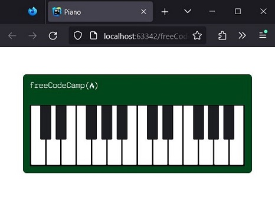
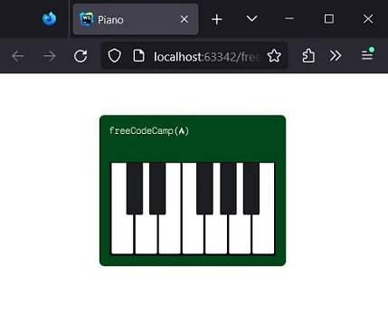

# freeCodeCamp - Responsive Web Design - Learn Responsive Web Design by Building a Piano

## Result







## Steps

1. Start with the basic HTML structure.
   Add the DOCTYPE declaration and the html, head, body and title elements.
   Set the language of this page to English.
   Set the title element to Piano.
```
<!DOCTYPE html>
<html lang="en">
  <head>
   <title>Piano</title>
  </head>
  <body>
  </body>
</html>
```

2. Add two meta tags, one to optimize the page for mobile devices
   and one to specify an accepted charset for the page.
```
<meta charset="UTF-8"/>
<meta name="viewport" content="width=device-width, initial-scale=1.0"/>
```

3. Time to start working on the piano.
   Create a div element inside the body element with the id set to piano.
```
<div id="piano"></div>
```

4. Place a second div element inside the existing div and set class to keys.
```
<div class="keys"></div>
```

5. Inside the .keys element, add seven div elements.
   Give them all the key class.
```
<div class="keys">
     <div class="key"></div>
     <div class="key"></div>
     <div class="key"></div>
     <div class="key"></div>
     <div class="key"></div>
     <div class="key"></div>
     <div class="key"></div>
</div>
```

6. Remember that a class attribute can have multiple values.
   To separate the white piano keys from the black keys, you will add a second class with the value black--key.
   Add it to the second, third, fifth, sixth, and seventh .key elements.
```
<div class="keys">
     <div class="key"></div>
     <div class="key black--key"></div>
     <div class="key black--key"></div>
     <div class="key"></div>
     <div class="key black--key"></div>
     <div class="key black--key"></div>
     <div class="key black--key"></div>
</div>
```

7. Now copy the set of seven .key elements and paste two more sets into the .keys div.
```
<div id="piano">
     <div class="keys">
         <div class="key"></div>
         <div class="key black--key"></div>
         <div class="key black--key"></div>
         <div class="key"></div>
         <div class="key black--key"></div>
         <div class="key black--key"></div>
         <div class="key black--key"></div>
         <div class="key"></div>
         <div class="key black--key"></div>
         <div class="key black--key"></div>
         <div class="key"></div>
         <div class="key black--key"></div>
         <div class="key black--key"></div>
         <div class="key black--key"></div>
         <div class="key"></div>
         <div class="key black--key"></div>
         <div class="key black--key"></div>
         <div class="key"></div>
         <div class="key black--key"></div>
         <div class="key black--key"></div>
         <div class="key black--key"></div>
     </div>
</div>
```

8. Add a link element inside the head element.
   For this link element, set the rel attribute to stylesheet and href to ./styles.css.
```
<link type="text/css" rel="stylesheet" href="./styles.css"/>
```

9. Browsers can apply default margin and padding values to specific elements.
   To ensure your piano looks correct, you need to reset the box model.
   Add an html rules selector to your CSS file and set the box-sizing property to border-box.
```
html {
     box-sizing: border-box;
}
```

10. Now that you have redefined the html box model, you need to pass this to the internal elements as well.
    To do this, you can set the box-sizing property to inherit, which will tell the target elements
    that we use the same value as the parent element.
    You'll also need to point to pseudo-elements, which are special keywords that follow a selector.
    The two pseudo-elements you will use are ::before and ::after.
    ::before creates a pseudo-element that is the first child of the selected element, while ::after creates a pseudo-element
    which is the last child of the selected element.
    These pseudo-elements are often used to create aesthetic content, something you'll see later in this project.
    For now, create a CSS selector that points to all elements using * and includes pseudo-elements with ::before and ::after.
    Set the box-sizing property to inherit.
```
*, ::before, ::after {
     box-sizing: inherit;
}
```

11. Now give the #piano element an id selector.
    Set the background-color property to #00471b, a width property to 992px, and a height property to 290px.
```
#piano {
     background-color: #00471b;
     width: 992px;
     height: 290px;
}
```

12. Set the margin of the #piano element to 80px auto.
```
#piano {
     background-color: #00471b;
     width: 992px;
     height: 290px;
     margin: 80px auto;
}
```

13. Time to style the keys.
    Below the #piano rule, select the .keys elements with a class selector.
    Give the new rule a background-color property of #040404, a width property of 949px, and a height property of 180px.
```
.keys {
     background-color: #040404;
     width: 949px;
     height: 180px;
}
```

14. Give .keys a padding-left of 2px.
```
.keys {
     background-color: #040404;
     width: 949px;
     height: 180px;
     padding-left: 2px;
}
```

15. Move the keys to the right position by adjusting the #piano selector.
    Set the padding property to 90px 20px 0 20px.
```
#piano {
     background-color: #00471b;
     width: 992px;
     height: 290px;
     margin: 80px auto;
     padding: 90px 20px 0 20px;
}
```

16. Time to style the keys themselves. Create a class selector for the .key elements.
    Sets background-color to the value #ffffff, the position property to relative, the width property to 41px
    and the height property as 175px.
```
.key {
     background-color: #ffffff;
     position: relative;
     width: 41px;
     height: 175px;
}
```

17. Give the .key a 2px margin and the float property set to left.
```
.key {
     background-color: #ffffff;
     position: relative;
     width: 41px;
     height: 175px;
     margin: 2px;
     float: left;
}
```

18. Now it's time to use the pseudo selectors you prepared earlier.
    To create black keys, add a new selector .key.black--key::after.
    It will target elements with the key class black--key and will select the pseudo-element after these elements in the HTML.
    In the new selector, set the background-color to #1d1e22. Also set the content property to "".
    This will leave the pseudo elements empty.
    The content property is used to set or override the content of the element.
    By default, the pseudo-elements created by the ::before and ::after pseudo-selectors are empty and the elements will not be rendered on the page.
    Setting the content property to an empty string "" will ensure that the element is rendered on the page even though it is still empty.
    If you want to experiment, try removing the background-color property and setting different values for the content property, such as "♥".
    Remember to undo these changes when finished so the tests pass.
```
.key.black--key::after{
     background-color: #1d1e22;
     content: "";
}
```

19. Give .key.black--key::after a position property set to absolute and a left property set to -18px.
```
.key.black--key::after {
     background-color: #1d1e22;
     content: "";
     position: absolute;
     left: -18px;
}
```

20. For .key.black--key::after, set width to 32px and height to 100px.
```
.key.black--key::after {
     background-color: #1d1e22;
     content: "";
     position: absolute;
     left: -18px;
     width: 32px;
     height: 100px;
}
```

21. The piano needs the freeCodeCamp logo to make it official.
    Add an img element below the .keys element.
    Give the img a class logo and set src to `https://cdn.freecodecamp.org/platform/universal/fcc_primary.svg`.
    Give the image an alt text of freeCodeCamp Logo.
```

```

22. Start styling the logo by creating a .logo selector.
    Set width to 200px, position to absolute and top to 23px.
```
.soon {
     width: 200px;
     position: absolute;
     top: 23px;
}
```

23. The img element needs its parent to have a position defined as a reference point.
    Set the position property of the #piano selector to relative.
```
#piano {
     background-color: #00471b;
     width: 992px;
     height: 290px;
     margin: 80px auto;
     padding: 90px 20px 0 20px;
     position: relative;
}
```

24. To soften the sharp edges of the piano and keys, start by giving #piano a border-radius of 10px.
```
#piano {
     background-color: #00471b;
     width: 992px;
     height: 290px;
     margin: 80px auto;
     padding: 90px 20px 0 20px;
     position: relative;
     border-radius: 10px;
}
```

25. Give the .key selector the border-radius value of 0 0 3px 3px.
```
.key {
     background-color: #ffffff;
     position: relative;
     width: 41px;
     height: 175px;
     margin: 2px;
     float: left;
     border-radius: 0 0 3px 3px;
}
```

26. Give the .key.black--key::after selector a border-radius of 0 0 3px 3px to match the keys.
```
.key.black--key::after {
     background-color: #1d1e22;
     content: "";
     position: absolute;
     left: -18px;
     width: 32px;
     height: 100px;
     border-radius: 0 0 3px 3px;
}
```

27. The @media rule, also known as media query, is used to conditionally apply CSS.
    Media queries are commonly used to apply CSS based on the viewport width using the max-width and min-width properties.
    In the example below, padding is applied to the .card class when the viewport is 960px wide or less.
```
@media (max-width: 960px) {
   .card {
     padding: 2rem;
   }
}
```
Add a media query that will be applied when the viewport is 768px wide or less.
```
@media (max-width: 768px) {
}
```

28. Add a new #piano selector inside the @media query and set the width to 358px.
```
@media (max-width: 768px) {
     #piano {
         width: 358px;
     }
}
```

29. Inside the @media query, add a .keys selector and set the width to 318px.
```
@media (max-width: 768px) {
     #piano {
         width: 358px;
     }

     .keys {
         width: 318px;
     }
}
```

30. Now add a .logo selector to the @media query and set the width property to 150px.
```
@media (max-width: 768px) {
     #piano {
         width: 358px;
     }

     .keys {
         width: 318px;
     }

     .soon {
         width: 150px;
     }
}
```

31. You may have noticed that the keys do not appear when the browser window is smaller than 768px.
    Set overflow to hidden in the first .keys selector to resolve this issue.
    This property will hide any element that is pushed outside the defined width value for .keys.
```
.keys {
     background-color: #040404;
     width: 949px;
     height: 180px;
     padding-left: 2px;
     overflow: hidden;
}
```

32. Logical operators can be used to construct more complex media queries.
    The logical operator `and` is used to query two conditions for media queries.
    For example, a media query that targets a display width between 500px and 1000px would be:
```
@media (min-width: 500px) and (max-width: 1000px){
}
```
Add another @media rule to apply if the browser window is wider than 769px but smaller than 1199px.
```
@media (min-width: 769px) and (max-width: 1199px) {
}
```

33. For the new @media rule, set the width of #piano to 675px and the width of .keys to 633px.
    With this, your piano is complete!
```
@media (max-width: 1199px) and (min-width: 769px) {
     #piano {
         width: 675px;
     }

     .keys {
         width: 633px;
     }
}
```


## References
https://www.freecodecamp.org/learn/2022/responsive-web-design/learn-responsive-web-design-by-building-a-piano/
, accessed on 11/07/2023.