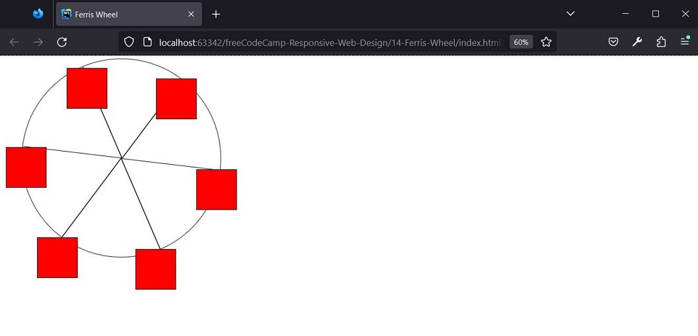

# freeCodeCamp - Responsive Web Design - Learn CSS Animation by Building a Ferris Wheel

## Result




## Steps

1. Start with the standard boilerplate.
   Add the DOCTYPE declaration and the html (with the language set to English), head and body elements.
   Add your meta element with the correct charset, the title element and a link element that links the ./styles.css file.
   Set the title title to Ferris Wheel.
```
<!DOCTYPE html>
<html lang="en">
<head>
     <meta charset="UTF-8"/>
     <meta http-equiv="X-UA-Compatible" content="IE=edge"/>
     <meta name="viewport" content="width=device-width, initial-scale=1.0"/>
     <title>Ferris Wheel</title>
     <link type="text/css" rel="stylesheet" href="./styles.css"/>
</head>
<body>
</body>
</html>
```

2. Add a div inside the body element and give it a class with the value wheel.
   Inside the new div, add six span elements with a class set to line
   and six div elements with a class set to cabin.
```
<body>
     <div class="wheel">
         <span class="line"></span>
         <span class="line"></span>
         <span class="line"></span>
         <span class="line"></span>
         <span class="line"></span>
         <span class="line"></span>
         <div class="cabin"></div>
         <div class="cabin"></div>
         <div class="cabin"></div>
         <div class="cabin"></div>
         <div class="cabin"></div>
         <div class="cabin"></div>
     </div>
</body>
```

3. Create a selector for the .wheel element.
   Start by setting the border to 2px solid black, the border-radius to 50% and the margin-left to 50px.
```
.wheel {
     border: 2px solid black;
     border-radius: 50%;
     margin-left: 50px;
}
```

4. Set the position property of the .wheel selector to absolute.
   Set height and width to 55vw each.
```
.wheel {
     border: 2px solid black;
     border-radius: 50%;
     margin-left: 50px;
     position: absolute;
     height: 55vw;
     width: 55vw;
}
```

5. Give the .wheel selector the max-height and max-width properties with a value of 500px.
```
.wheel {
     border: 2px solid black;
     border-radius: 50%;
     margin-left: 50px;
     position: absolute;
     height: 55vw;
     width: 55vw;
     max-height: 500px;
     max-width: 500px;
}
```

6. Create a selector for the .line elements.
   Start by setting the background-color to black, width to 50% and height to 2px.
```
.line {
     background-color: black;
     width: 50%;
     height: 2px;
}
```

7. Set the .line selector position to absolute, the left property to 50% and the top property to 50%.
```
.line {
     background-color: black;
     width: 50%;
     height: 2px;
     position: absolute;
     left: 50%;
     top: 50%;
}
```

8. The transform-origin property is used to define the point around which a CSS transform is applied.
   For example, when performing a rotate (which you will do later in this project),
   transform-origin determines around which point the element is rotated.
   Set the .line selector to have a transform-origin of 0% 0%.
   This will set the origin point to be offset 0% from the left and 0% from the top, positioning it in the middle of the top edge of the element.
```
.line {
     background-color: black;
     width: 50%;
     height: 2px;
     position: absolute;
     left: 50%;
     top: 50%;
     transform-origin: 0% 0%;
}
```

9. Create a selector for the second .line element.
   Set the transform property to rotate(60deg).
   Remember that the transform property allows you to manipulate the shape of an element.
   In this case, using the value of rotate(60deg) will rotate the element around its transform-origin point by 60 degrees clockwise.
```
.line:nth-of-type(2) {
     transform: rotate(60deg);
}
```

10. Using the same pattern, create a separate selector for the third .line, fourth .line, fifth .line, and sixth .line.
    Set the transform property for the third .line to rotate(120deg),
    to the fourth to rotate(180deg), to the fifth to rotate(240deg) and to the sixth to rotate(300deg).
```
.line:nth-of-type(3) {
     transform: rotate(120deg);
}

.line:nth-of-type(4) {
     transform: rotate(180deg);
}

.line:nth-of-type(5) {
     transform: rotate(240deg);
}

.line:nth-of-type(6) {
     transform: rotate(300deg);
}
```

11. Create a .cabin element.
    Start by setting the background-color to red, width to 20% and height to 20%.
```
.cabin {
     background-color: red;
     width: 20%;
     height: 20%;
}
```

12. Give .cabin a position absolute and a border of 2px solid.
```
.cabin {
     background-color: red;
     width: 20%;
     height: 20%;
     position: absolute;
     border: 2px solid;
}
```

13. Set the .cabin to have a transform-origin property of 50% 0%.
    This will set the origin point to be offset 50% from the left and 0% from the top, positioning it in the middle of the top edge of the element.
```
.cabin {
     background-color: red;
     width: 20%;
     height: 20%;
     position: absolute;
     border: 2px solid;
     transform-origin: 50% 0%;
}
```

14. Time to position the cabins around the wheel.
    Select the first .cabin element.
    Set the right property to -8.5% and the top property to 50%.
```
.cabin:nth-of-type(1) {
     right: -8.5%;
     top: 50%;
}
```

15. Continuing the pattern, select the following .cabin elements and apply the specific rules to them:
- The second .cabin must have the right property set to 17% and the top property set to 93.5%.
- The third .cabin must have the right property set to 67% and the top property set to 93.5%.
- The .cabin room must have the left property set to -8.5% and the top property set to 50%.
- The fifth .cabin must have the left property set to 17% and the top property set to 7%.
- The sixth .cabin must have the right property set to 17% and the top property set to 7%.
```
.cabin:nth-of-type(2) {
     right: 17%;
     top: 93.5%;
}

.cabin:nth-of-type(3) {
     right: 67%;
     top: 93.5%;
}

.cabin:nth-of-type(4) {
     left: -8.5%;
     top: 50%;
}

.cabin:nth-of-type(5) {
     left: 17%;
     top: 7%;
}

.cabin:nth-of-type(6) {
     right: 17%;
     top: 7%;
}
```

16. The @keyframes rule is used to define the flow of a CSS animation.
    Inside the @keyframes rule, you can create selectors for specific points in the animation sequence,
    such as 0% or 25%, or use from and to to define the start and end of the sequence.
    @keyframes rules require a name to be assigned to them, which you will in turn use in other rules for reference.
    For example, the rule @keyframes freeCodeCamp { } would be named freeCodeCamp.
    Time to start cheering up. Create a @keyframes rule called wheel.
```
@keyframes wheel {
}
```

17. Now, you need to define how your animation should start.
    To do this, create a 0% rule inside your @keyframes wheel rule.
    The properties you set in this nested selector will be applied at the start of your animation.
    For example, this would be a 12% rule:
```
@keyframes freecodecamp {
   12% {
     color: green;
   }
}
```
```
@keyframes wheel {
     0% {
     }
}
```

18. Give the 0% rule a transform property of rotate(0deg). This will start a non-rotating animation.
```
@keyframes wheel {
     0% {
         transform: rotate(0deg);
     }
}
```

19. Now give the @keyframes wheel rule a selector of 100%.
    Within that, set transform to rotate(360deg).
    When you do this, your animation will complete an entire rotation.
```
@keyframes wheel {
     0% {
         transform: rotate(0deg);
     }
     100% {
         transform: rotate(360deg);
     }
}
```

20. The animation-name property is used to bind a @keyframes rule to a CSS selector.
    The value of this property must match the @keyframes rule name.
    Give the .wheel selector the animation-name property set to wheel.
    The animation-duration property is used to define how long the animation sequence should last until it is completed.
    The time must be specified in seconds (s) or milliseconds (ms).
    Give the .wheel selector the animation-duration property set to 10s.
```
.wheel {
     border: 2px solid black;
     border-radius: 50%;
     margin-left: 50px;
     position: absolute;
     height: 55vw;
     width: 55vw;
     max-height: 500px;
     max-width: 500px;
     animation-name: wheel;
     animation-duration: 10s;
}
```

21. The animation-iteration-count property defines how many times your animation should repeat.
    This can be set to a number, or infinite to repeat the animation indefinitely.
    Your Ferris wheel should never stop, so set the .wheel selector to have an animation-iteration-count set to infinite.
    The animation-timing-function property defines how the animation should progress over time.
    There are a few different values for this property, but you want the Ferris wheel animation to run at the same rate from start to finish.
    Set animation-timing-function to linear in selector.wheel.
```
.wheel {
     border: 2px solid black;
     border-radius: 50%;
     margin-left: 50px;
     position: absolute;
     height: 55vw;
     width: 55vw;
     max-height: 500px;
     max-width: 500px;
     animation-name: wheel;
     animation-duration: 10s;
     animation-iteration-count: infinite;
     animation-timing-function: linear;
}
```

22. Create a @keyframes rule with the name cabins.
    Use the same properties as your @keyframes wheel, copying the 0% and 100% rules,
    but set the transform property of the selector 100% to rotate(-360deg).
```
@keyframes cabins {
     0% {
         transform: rotate(0deg);
     }
     100% {
         transform: rotate(-360deg);
     }
}
```

23. With the .wheel selector, you have created four different properties to control the animation.
    For your .cabin selector, you can use the animation property to set everything at once.
    Set the animation property of the .cabin rule to cabins 10s linear infinite.
    This will set the properties of animation-name, animation-duration, animation-timing-function
    and animation-iteration-count in that order.
```
.cabin {
     background-color: red;
     width: 20%;
     height: 20%;
     position: absolute;
     border: 2px solid;
     transform-origin: 50% 0%;
     animation: cabins 10s linear infinite;
}
```


## References
https://www.freecodecamp.org/learn/2022/responsive-web-design/learn-css-animation-by-building-a-ferris-wheel/
, accessed on 11/26/2023.