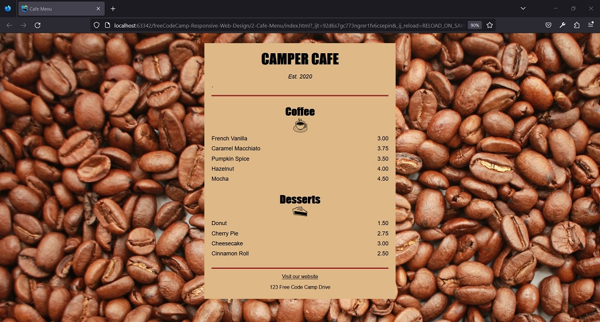

# freeCodeCamp - Design responsivo para a web - Aprenda CSS básico criando um menu de restaurante
 
## Resultado



## Passos
Os passos para construir o projeto foram:
1. Adicione a tag <!DOCTYPE html> e um elemento html com um atributo lang de en.
```
<!DOCTYPE html>
<html lang="en"></html>
```

2. Adicione um elemento head dentro do elemento html para que você possa adicionar um elemento title. 
O texto do elemento title deve ser Cafe Menu.
```    
<head>
    <title>Cafe Menu</title>
</head>
```

3. Dentro do elemento head, adicione um elemento meta com um atributo chamado charset definido para o valor utf-8 para 
dizer ao navegador como codificar caracteres para a página. Note que os elementos meta fecham em si mesmos.
`<meta charset="UTF-8"/>`

4. Para preparar seu código para criar conteúdo, adicione um elemento body abaixo do elemento head. 
`<body></body>`

5. Adicione um elemento main dentro do elemento body existente. 
Mais pra frente ele conterá informações sobre preços dos cafés e sobremesas oferecidas pela cafeteria. 
`<main></main>`

6. O nome da cafeteria é CAMPER CAFE. 
Você deve criar um elemento h1 dentro do elemento main. 
Coloque o nome da cafeteria em letras maiúsculas para que ele se destaque.
`<h1>CAMPER CAFE</h1>`

7. Para que os visitantes saibam que o café foi fundado em 2020, 
adicione um elemento p abaixo do elemento h1 com o texto Est. 2020.
`<p>Est. 2020</p>`

8. Adicione um elemento section dentro do elemento main para que você tenha um lugar onde colocar todos os cafés disponíveis.
`<section></section>`

9. Crie um elemento h2 no elemento section e dê a ele o texto Coffee.
`<h2>Coffee</h2>`

10. Até agora, você tem sido limitado em relação à apresentação e aparência do conteúdo que você cria. 
Para começar a tomar o controle, adicione um elemento style dentro do elemento head.
`<style></style>`

11. Você pode adicionar estilo a um elemento, especificando-o no elemento style e definindo uma propriedade para ele.
Centralize seu elemento h1 definindo sua propriedade text-align para o valor center.
```
<style>
  h1{
    text-align: center;
  }
</style>
```

12. No passo anterior, você usou um seletor de tipo para estilizar o elemento h1. 
Centralize os elementos h2 e p adicionando um novo seletor de tipo para cada um no elemento style existente.
```
<style>
  h1 {
    text-align: center;
  }
  h2 {
    text-align: center;
  }
  p {
    text-align: center;
  }
</style>
```

13. Você pode adicionar o mesmo grupo de estilos a muitos elementos, criando uma lista de seletores. 
Cada seletor é separado por vírgulas.
Exclua os três seletores de tipos existentes e substitua-os por uma lista de seletores que centraliza 
o texto para os elementos h1, h2 e p.
```
<style>
  h1, h2, p {
    text-align: center;
  }
</style>
```

14. Você estilizou três elementos escrevendo CSS dentro das tags style. 
Isso funciona, mas como haverá vários outros estilos, é melhor colocar todos os estilos em um arquivo separado e vincular a ele.
Criamos um arquivo separado styles.css para você e trocamos a visualização do editor para esse arquivo. 
Você pode alternar a visualização dos arquivos nas abas na parte superior do editor.
Comece reescrevendo os estilos que você criou no arquivo styles.css. 
Certifique-se de excluir a tag de abertura e de fechamento de style.

15. Agora que você tem o CSS no arquivo styles.css, vá em frente e remova o elemento style e todo seu conteúdo. 
Uma vez removido, o texto centralizado voltará para a esquerda.

16. Agora você precisa vincular o arquivo styles.css para que os estilos sejam aplicados novamente. 
Adicione um elemento link de fechamento automático ao elemento head. 
Dê a ele o valor do atributo rel de stylesheet e o valor do atributo href de styles.css.
`<link rel="stylesheet" href="styles.css"/>`

17. Para que a estilização da página pareça semelhante no celular, em um desktop ou em um laptop, 
você precisa adicionar um elemento meta com um atributo especial content.
Adicione o seguinte dentro do elemento head: `<meta name="viewport" content="width=device-width, initial-scale=1.0"/>`

18. O texto está centralizado novamente, então o link para o arquivo CSS está funcionando. 
Adicione outro estilo ao arquivo que altere a propriedade background-color para brown para o elemento body.
```
body {
  background-color: brown;
}
```

19. Esse fundo marrom dificulta a leitura do texto. 
Altere a cor de fundo do elemento body para que seja burlywood de modo que ele tenha cor, mas que você ainda possa ler o texto.
```
body {
  background-color: burlywood ;
}
```

20. Ao contrário dos outros elementos de conteúdo que você usou até agora, 
o elemento div é usado principalmente para fins de layout de design.
Adicione um elemento div dentro do elemento body e, em seguida, mova todos os outros elementos dentro do novo div.
Dentro da tag de abertura da div, adicione o atributo id com o valor de menu.
`<div id="menu"></div>`

21. Agora o objetivo é fazer a div não ocupar toda a largura da página. 
A propriedade CSS width é perfeita para isso.
Você deve usar o seletor id para marcar um elemento div específico. 
Um seletor de id é definido por um nome com um símbolo de hashtag diretamente na frente dele.
Use o seletor #menu para dar ao elemento uma largura de 300px.
```
#menu {
  width: 300px;  
}
```

22. Comentários em CSS têm esta aparência: `/* comment here */`
Na sua folha de estilo, comente a linha que contém a propriedade e valor do background-color, 
para poder ver o efeito de estilizar apenas o elemento #menu. Isto tornará o fundo branco de novo.
`/*background-color: burlywood;*/`

23. Agora, use o seletor #menu existente para definir a cor de fundo do elemento div para que seja burlywood.
`background-color: burlywood;`

24. Agora é fácil ver que o texto está centrado dentro do elemento #menu. 
Atualmente, a largura do elemento #menu é especificada em pixels (px).
Altere o valor da propriedade width para que seja 80%, o que a tornará 80% da largura do seu elemento pai (body).
```
#menu {
    width: 80%;
    background-color: burlywood;
}
```

25. Em seguida, centralize a #menu horizontalmente. Você pode fazer isso definindo as propriedades margin-left e margin-right como auto. 
Pense na margem como um espaço invisível em torno de um elemento. 
Usando essas duas propriedades de margem, centralize o elemento #menu dentro do elemento body.
```
#menu {
    width: 80%;
    background-color: burlywood;
    margin-left: auto;
    margin-right: auto;
}
```

26. Até agora, você tem usado seletores de tipo e de id para elementos de estilo. 
No entanto, é mais comum usar um seletor diferente para estilizar os elementos.
Um seletor de classe é definido por um nome com um ponto diretamente na frente dele
Altere o seletor #menu existente para um seletor de classe substituindo #menu por uma classe chamada .menu.
```
.menu {
    width: 80%;
    background-color: burlywood;
    margin-left: auto;
    margin-right: auto;
}
```

27. Para aplicar o estilo da classe para o elemento div, 
remova o atributo id e adicionar o atributo class à tag de abertura do elemento div. 
Certifique-se de definir o valor de class como menu.
`<div class="menu">`

28. Como o principal produto para venda na cafeteria é o café, você pode usar uma imagem de grãos de café para o fundo da página.
Exclua o comentário e o conteúdo dentro do seletor de tipos body. 
Em seguida, adicione uma propriedade background-image 
e defina seu valor como url(https://cdn.freecodecamp.org/curriculum/css-cafe/beans.jpg)
```
body {
    background-color: burlywood;
    background-image: url(https://cdn.freecodecamp.org/curriculum/css-cafe/beans.jpg);
}
```

29. A aparência é boa. É hora de começar a adicionar alguns itens de menu. 
Adicione um elemento vazio article abaixo do título Coffee. 
Ele conterá o sabor e o preço de cada café que você oferecer.
`<article></article>`

30. Elementos article comumente contêm vários elementos que possuem informações relacionadas. 
Neste caso, ele vai conter um sabor de café e um preço por esse sabor. 
Aninhe dois elementos p dentro do elemento article. 
O primeiro texto deve ser French Vanilla e o segundo texto deve ser 3.00.
```
<article>
    <p>French Vanilla</p>
    <p>3.00</p>
</article>
```

31. Começando abaixo do par café/preço existente, adicione os cafés e preços abaixo usando elementos article 
com dois elementos aninhados dentro de cada p. 
Como antes, o primeiro texto p deve conter o sabor do café e o segundo texto p deve conter o preço.
```
Caramel Macchiato 3.75
Pumpkin Spice 3.50
Hazelnut 4.00
Mocha 4.50
```
```
<article>
    <p>French Vanilla</p>
    <p>3.00</p>
</article>
<article>
    <p>Caramel Macchiato</p>
    <p>3.75</p>
</article>
<article>
    <p>Pumpkin Spice</p>
    <p>3.50</p>
</article>
<article>
    <p>Hazelnut</p>
    <p>4.00</p>
</article>
<article>
    <p>Mocha</p>
    <p>4.50</p>
</article>
```

32. Os sabores e preços estão atualmente empilhados uns sobre os outros e centrados com seus elementos p respectivos. 
Seria bom se o sabor estivesse à esquerda e o preço estivesse à direita.
Adicione o nome da classe flavor ao elemento p que diz French Vanilla.
`<p class="flavor">French Vanilla</p>`

33. Usando sua nova classe flavor como seletor, defina o valor da propriedade text-align para left.
```
.flavor{
    text-align: left;
}
```

34. Em seguida, você deve alinhar o preço à direita. Adicione uma classe chamada price ao seu elemento p que tem o texto 3.00.
`<p class="price">3.00</p>`

35. Agora alinhe o texto com right para os elementos com a classe price.
```
.price{
    text-align: right;
}
```

36. Agora está mais próximo do que você quer, mas seria legal se o sabor e o preço estivessem na mesma linha. 
Elementos p são elementos em nível de bloco, então eles ocupam toda a largura do seu elemento pai.
Para fazer com que fiquem na mesma linha, você precisa aplicar algum tipo de estilo aos elementos p, 
de modo que eles comecem a se comportar mais como elementos inline. 
Para fazer isso, comece adicionando um atributo class com o valor item para o primeiro elemento article sob o título Coffee.
`<article class="item">`

37. Os elementos p estão aninhados em um elemento article com o atributo de classe item. 
Você pode estilizar todos os elementos p aninhados em qualquer lugar dos elementos com uma classe chamada item como esta:
`.item p { }`
Usando o seletor acima, adicione uma propriedade display com valor inline-block para que os elementos p se 
comportem mais como elementos em linha.
```    
.item p {
    display: inline-block;
}
```

38. Isso é mais perto, mas o preço não ficou mais à direita. Isto se deve ao fato de que os elementos inline-block só 
ocupam a largura de seu conteúdo. 
Para distribuí-los, adicione uma propriedade width aos seletores de classe flavor e price com um valor de 50% cada.
```
.flavor {
  text-align: left;
  width: 50%;
}

.price {
  text-align: right;
  width: 50%;
}
```

39. Pois bem, isso não funcionou. Estilizar os elementos p como inline-block e colocá-los em linhas separadas no código 
cria um espaço extra à direita do primeiro elemento p, fazendo com que o segundo se desloque para a linha seguinte. 
Uma maneira de corrigir isso é fazer com que a largura de cada elemento p seja menor que 50%.
Altere a width de cada classe para 49% e veja o que acontece.
```
.flavor {
  text-align: left;
  width: 49%;
}

.price {
  text-align: right;
  width: 49%;
}
```

40. Legal, funcionou. Mas ainda há um pouco de espaço à direita do preço.
Você poderia continuar tentando várias porcentagens para as larguras. 
Em vez disso, use a tecla de Backspace no seu teclado para mover o elemento p com a classe price para o lado 
do elemento p com a classe flavor para que eles estejam na mesma linha no editor. 
Certifique-se de que não haja um espaço entre eles.
`<p class="flavor">French Vanilla</p><p class="price">3.00</p>`

41. Agora vá em frente e altere a largura das classes flavor e price para 50% novamente.
```
.flavor {
  text-align: left;
  width: 50%;
}

.price {
  text-align: right;
  width: 50%;
}
```

42. Agora que você sabe que funciona, você pode alterar os elementos article e p restantes para 
corresponderem ao primeiro conjunto. 
Comece adicionando a classe item aos outros elementos article.
```
<article class="item">
    <p>Caramel Macchiato</p><p>3.75</p>
</article>
<article class="item">
    <p>Pumpkin Spice</p><p>3.50</p>
</article>
<article class="item">
    <p>Hazelnut</p><p>4.00</p>
</article>
<article class="item">
    <p>Mocha</p><p>4.50</p>
</article>
```

43. Em seguida, posicione os outros elementos p na mesma linha, sem espaço entre eles.

44. Para completar a estilização, adicione os nomes de classe aplicáveis flavor e price a todos os elementos p restantes.
```
<article class="item">
    <p class="flavor">Caramel Macchiato</p><p class="price">3.75</p>
</article>
<article class="item">
    <p class="flavor">Pumpkin Spice</p><p class="price">3.50</p>
</article>
<article class="item">
    <p class="flavor">Hazelnut</p><p class="price">4.00</p>
</article>
<article class="item">
    <p class="flavor">Mocha</p><p class="price">4.50</p>
</article>
```

45. Se você tornar a largura da visualização da página menor, você notará, em algum ponto, 
que parte do texto à esquerda começa a quebrar para a próxima linha. 
Isso ocorre porque a largura dos elementos p do lado esquerdo só pode ocupar 50% do espaço.
Uma vez que você sabe que os valores à direita têm significativamente menos caracteres, 
altere o valor width da classe flavor para 75% e a width da classe price para 25%.
```
.flavor {
    text-align: left;
    width: 75%;
}

.price {
    text-align: right;
    width: 25%;
}
```

46. Você ainda vai voltar à estilização do menu, mas, por agora, 
adicione um segundo elemento section abaixo do primeiro para mostrar as sobremesas oferecidas pela cafeteria.
`<section></section>`

47. Adicione um elemento h2 na nova seção e dê a ele o texto Desserts. 
`<h2>Desserts</h2>`

48. Adicione um elemento vazio article abaixo do título Desserts. Dê a ele um atributo class com o valor item.
`<article class="item"></article>`

49. Coloque dois elementos p dentro do elemento article. O texto do primeiro elemento deve ser Donut 
e o texto do segundo deve ser 1.50. 
Coloque os dois na mesma linha, garantindo que não haja espaço entre eles.
`<p>Donut</p><p>1.50</p>`

50. Para os dois elementos p que você acabou de adicionar, adicione dessert como o valor do atributo class do 
primeiro elemento p e price como valor do atributo class do segundo elemento p.
`<p class="dessert">Donut</p><p class="price">1.50</p>`

51. Alguma coisa parece não estar certa. Você adicionou o valor correto do atributo class para o elemento p que 
tem o texto Donut, mas você não definiu um seletor para ele.
A regra de CSS para a classe flavor já define as propriedades que você deseja. 
Adicione a classe dessert como um seletor adicional para essa regra do CSS.
```
.flavor, .dessert {
    text-align: left;
    width: 75%;
}
```

52. Abaixo da sobremesa que você acabou de adicionar, adicione o resto das sobremesas e preços usando mais três elementos 
de article, cada um com dois elementos p dentro deles. Cada elemento deve ter o texto da sobremesa e do preço corretos. 
Todos devem ter as classes corretas.
```
Cherry Pie 2.75
Cheesecake 3.00
Cinnamon Roll 2.50
```
```
<article class="item">
    <p class="dessert">Cherry Pie</p><p class="price">2.75</p>
</article>
<article class="item">
    <p class="dessert">Cheesecake</p><p class="price">3.00</p>
</article>
<article class="item">
    <p class="dessert">Cinnamon Roll</p><p class="price">2.50</p>
</article>
```

53. Você pode dar ao seu menu um pouco mais de espaço entre o conteúdo e os lados com várias propriedades padding.
Dê à classe menu um padding-left e um padding-right com o mesmo valor de 20px.
```
.menu {
    width: 80%;
    background-color: burlywood;
    margin-left: auto;
    margin-right: auto;
    padding-left: 20px;
    padding-right: 20px;
}
```

54. Assim está bem melhor. Agora, tente adicionar o mesmo preenchimento interno de 20px ao topo e à base do menu.
```
.menu {
    width: 80%;
    background-color: burlywood;
    margin-left: auto;
    margin-right: auto;
    padding-left: 20px;
    padding-right: 20px;
    padding-top: 20px;
    padding-bottom: 20px;
}
```

55. Já que todos os 4 lados do menu têm o mesmo espaçamento interno, exclua as quatro propriedades 
e use uma única propriedade padding com o valor 20px.
```
.menu {
    width: 80%;
    background-color: burlywood;
    margin-left: auto;
    margin-right: auto;
    padding: 20px;
}
```

56. A largura atual do menu sempre ocupará 80% da largura do elemento body. 
Em uma tela muito ampla, o café e a sobremesa aparecem muito distantes de seus preços.
Adicione uma propriedade max-width ao menu com um valor de 500px para evitar esse distanciamento em excesso.
```
.menu {
    width: 80%;
    background-color: burlywood;
    margin-left: auto;
    margin-right: auto;
    padding: 20px;
    max-width: 500px;
}
```

57. Você pode alterar o estilo de fonte com font-family, para que o texto fique diferente do estilo de fonte padrão do seu navegador. 
Cada navegador tem algumas fontes comuns já disponíveis.
Mude todo o texto em body, adicionando a propriedade font-family com o valor sans-serif. 
Esta é um fonte bastante comum que é bem legível.
```
body {
    background-color: burlywood;
    background-image: url(https://cdn.freecodecamp.org/curriculum/css-cafe/beans.jpg);
    font-family: sans-serif;
}
```

58. É um pouco chato ler todo um texto com a mesma font-family. 
Você ainda pode ter a maioria do texto em sans-serif e fazer apenas os elementos h1 e h2 terem um seletor diferente.
Estilize os elementos h1 e h2 para que apenas o texto desses elementos use a fonte Impact.
```
h1, h2 {
    font-family: Impact;
}
```

59. Você pode adicionar um valor de fallback para a font-family adicionando outro nome de fonte separado por uma vírgula. 
Os fallbacks são usados em instâncias onde a fonte inicial não é encontrada ou não está disponível.
Adicione a fonte de fallback serif após a fonte Impact.
```
h1, h2 {
    font-family: Impact, serif;
}
```

60. Deixe o texto Est. 2020 em itálico criando um seletor de classe established e, logo depois, 
dê a ele a propriedade font-style com o valor italic.
```
.established {
    font-style: italic;
}
```

61. Agora, aplique a classe established ao texto Est. 2020.
`<p class="established">Est. 2020</p>`

62. A tipografia dos elementos do cabeçalho (por exemplo, h1, h2) é definida por valores padrão dos navegadores dos usuários.
Adicione dois novos seletores de tipo (h1 e h2). 
Use a propriedade font-size para ambos, mas use o valor de 40px para h1 e 30px para o h2.
```
h1 {
    font-size: 40px;
}

h2 {
    font-size: 30px;
}
```

63. Adicione um elemento footer abaixo do elemento main, onde você pode colocar uma informação adicional sobre o conteúdo da página.
`<footer></footer>`

64. Dentro do footer, adicione um elemento p. 
Então, aninhe um elemento de âncora (a) no p que encaminhe para https://www.freecodecamp.org e tenha o texto Visit our website.
`<p> <a href="https://www.freecodecamp.org">Visit our website</a></p>`

65. Adicione um segundo elemento p abaixo do link e dê a ele o texto 123 Free Code Camp Drive. 
`<p>123 Free Code Camp Drive</p>`

66. Você pode usar um elemento hr para exibir um divisor entre seções de conteúdo diferente.
Primeiro, adicione um elemento hr entre o elemento p com a classe established e o primeiro elemento section. 
Observe que os elementos hr fecham em si mesmos.
`<hr/>`

67. As propriedades padrão de um elemento hr farão com que ele apareça como uma linha cinza claro fina. 
Você pode alterar a altura da linha especificando um valor para a propriedade height.
Altere a altura do elemento hr para que seja 3px.
```
hr {
    height: 3px;
}
```

68. Altere a cor de fundo do elemento hr para brown de modo que combine com a cor dos grãos de café.
```
hr {
    height: 3px;
    background-color: brown;
}
```

69. Observe a cor cinza ao longo das arestas da linha. 
Essas arestas são conhecidas como bordas. 
Cada lado de um elemento pode ter uma cor diferente ou eles podem ser todos iguais.
Faça com que todas as bordas do elemento hr sejam da mesma cor que o fundo dele usando a propriedade border-color.
```
hr {
    height: 3px;
    background-color: brown;
    border-color: brown;
}
```

70. Percebeu como a espessura da linha parece maior? 
O valor padrão da propriedade border-width é de 1px para todas as arestas dos elementos hr. 
Ao alterar a borda para a mesma cor do fundo, a altura total da linha é de 5px (3px mais a largura superior e inferior da borda, de 1px).
Altere a propriedade height do elemento hr para que seja de 2px, então a altura total dela se tornará 4px.
```
hr {
    height: 2px;
    background-color: brown;
    border-color: brown;
}
```

71. Adicione outro elemento hr entre o primeiro elemento main e o elemento footer. `<hr/>`

72. Para criar um pouco mais de espaço ao redor do menu, adicione 20px de espaço interno ao elemento body usando a propriedade padding.
```
body {
    background-color: burlywood;
    background-image: url(https://cdn.freecodecamp.org/curriculum/css-cafe/beans.jpg);
    font-family: sans-serif;
    padding: 20px;
}
```

73. Se nos concentrarmos nos itens do menu e nos preços, há um espaço relativamente grande entre cada linha.
Com o foco em todos os elementos p dentro de elementos com a class definida como item, defina a margem superior e inferior para que seja 5px.
```
.item p {
    display: inline-block;
    margin-top: 5px;
    margin-bottom: 5px;
}
```

74. Usando o mesmo seletor de estilo do passo anterior, torne maior o tamanho da fonte dos itens e preços usando um valor de 18px.
```
.item p {
  display: inline-block;
  margin-top: 5px;
  margin-bottom: 5px;
  font-size: 18px;
}
```

75. Alterar margin-bottom para 5px parece uma ótima ideia. 
No entanto, agora o espaço entre o item de menu Cinnamon Roll e o segundo elemento hr não combina com o espaço 
entre o elemento hr de cima e o título Coffee.
Adicione mais espaço criando uma classe chamada bottom-line, usando 25px para a propriedade margin-top.
```
.bottom-line{
    margin-top: 25px;
}
```

76. Agora, adicione a classe bottom-line ao segundo elemento hr para que o estilo seja aplicado.
`<hr class="bottom-line" />`

77. Em seguida, você estilizará o elemento footer. 
Para manter o CSS organizado, adicione um comentário ao final de styles.css com o texto FOOTER.
`/* FOOTER */ `

78. Descendo para o elemento footer, faça com que todo o texto tenha um valor de 14px para o tamanho da fonte.
```
footer {
    font-size: 14px;
}
```

79. A cor padrão de um link que ainda não foi clicado é tipicamente azul. 
A cor padrão de um link que já foi visitado a partir de uma página é tipicamente roxa.
Para tornar os links do footer da mesma cor, independentemente de um link ter sido visitado, 
use um seletor de tipo para o elemento de âncora (a) e use o valor black para a propriedade color.
```
a {
    color: black;
}
```

80. Você muda as propriedades de um link quando o link tenha sido visitado de fato usando um pseudosseletor, 
que tem essa aparência: a:visited { propertyName: propertyValue; }.
Mude a cor do rodapé Visit our website para grey quando um usuário tiver visitado o link.

```
a:visited {
    color: gray;
}
```

81. Você muda as propriedades de um link quando o mouse passa sobre ele usando um pseudosseletor,
que tem essa aparência: a:hover { propertyName: propertyValue; }.
Mude a cor do rodapé Visit our website para brown quando um usuário passar o mouse sobre ele.
```
a:hover {
    color: brown;
}
```

82. Você muda as propriedades de um link quando o link tiver sido clicado de fato usando um pseudosseletor, 
que tem essa aparência: a:active { propertyName: propertyValue; }.
Mude a cor do rodapé Visit our website para white quando um usuário clicar no link
```
a:active {
    color: white;
}
```

83. Para continuar com o mesmo tema da cor que você já está usando (preto e marrom), 
altere a cor para quando o link for visitado para black e use brown para quando o link for clicado de fato.
```
a:visited {
  color: black;
}

a:hover {
  color: brown;
}

a:active {
  color: brown;
}
```

84. O texto do menu CAMPER CAFE tem um espaço diferente do topo do que o espaço do endereço na parte inferior do menu. 
Isso se deve ao navegador ter uma margem superior padrão para o elemento h1.
Altere a margem superior do elemento h1 para 0 para remover toda a margem superior.
```
h1 {
  font-size: 40px;
  margin-top: 0;
}
```

85. Para remover um pouco do espaço vertical entre o elemento h1 e o texto Est. 2020, altere a margem inferior de h1 para 15px.
```
h1 {
    font-size: 40px;
    margin-top: 0;
    margin-bottom: 15px;
}
```

86. Agora o espaçamento superior parece bom. 
O espaço abaixo do endereço na parte inferior do menu é um pouco maior do que o espaço no topo do menu e no elemento h1.
Para diminuir o espaço de margem padrão abaixo do elemento p do endereço, crie um seletor de classe chamado address 
e use o valor 5px para a propriedade margin-bottom.

```
.address {
    margin-bottom: 5px;
}
```

87. Agora, aplique a classe address ao elemento p que contém o endereço 123 Free Code Camp Drive.
`<p class="address">123 Free Code Camp Drive</p>`

88. O menu está com uma boa aparência, mas, excetuando a imagem de fundo dos grãos de café, ele é basicamente feito de texto.
Sob o título Coffee, adicione uma imagem usando o url https://cdn.freecodecamp.org/curriculum/css-cafe/coffee.jpg. 
Dê à imagem um valor alt de coffee icon.
``

89. A imagem adicionada não está centralizada horizontalmente como o título Coffee acima dela. 
Elementos img são similares aos elementos em linha (inline).
Para fazer com que a imagem se comporte como elementos de título (que são de nível de bloco), 
crie um seletor de tipo img, use o valor block para a propriedade display e use os valores margin-left e margin-right 
aplicáveis para centralizá-la horizontalmente.
```
img {
    display: block;
    margin-left: auto;
    margin-right: auto;
}
```

90. Adicione uma última imagem sob o título Desserts usando o url https://cdn.freecodecamp.org/curriculum/css-cafe/pie.jpg. 
Dê à imagem um valor alt de pie icon.
``

91. Seria bom se o espaço vertical entre os elementos h2 e seus ícones associados fosse menor. 
Os elementos h2 têm o espaço de margem padrão superior e inferior, então você pode alterar a margem inferior dos elementos h2 para 0 ou outro número.
Existe uma maneira mais fácil, que é simplesmente adicionar uma margem superior negativa aos elementos img para puxá-los 
para cima de suas posições atuais. Valores negativos são criados usando - na frente do valor. 
Para completar este projeto, use uma margem superior negativa de 25px no seletor de tipos img.
```
img {
    display: block;
    margin-left: auto;
    margin-right: auto;
    margin-top: -25px;
}
```


## Referências
https://www.freecodecamp.org/portuguese/learn/2022/responsive-web-design/learn-basic-css-by-building-a-cafe-menu/ 
, acessado em 15/10/2023.