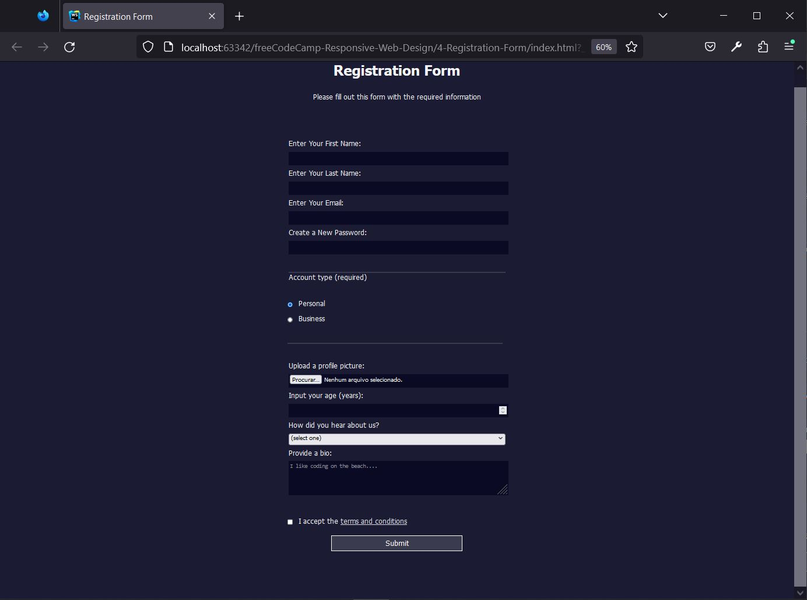

# freeCodeCamp - Design responsivo para a web - Aprenda formulários em HTML criando um formulário de registro

## Resultado



## Passos
1. Bem-vindo ao projeto do formulário de registro! Comece adicionando a declaração !DOCTYPE html no topo do documento 
para que o navegador saiba que tipo de documento está lendo.
`<!DOCTYPE html>`

2. Abaixo do DOCTYPE, adicione um elemento html com um atributo lang definido como en 
para que você tenha um lugar para começar a colocar o código.
`<html lang="en"></html>`

3. Em seguida, adicione as tags de abertura e fechamento de head e body dentro do elemento html.
```
<head></head>
<body></body>
```

4. Adicione os elementos title e meta a head. 
Dê ao projeto o título de Registration Form e dê ao atributo charset um valor de UTF-8 para o elemento meta
```
<title>Registration Form</title>
<meta charset="UTF-8"/>
```

5. Adicione um elemento link de fechamento automático ao elemento head. 
Dê a ele o valor do atributo rel de stylesheet e o valor do atributo href de styles.css.
`<link rel="stylesheet" href="styles.css"/>`

6. Dentro do body, crie um título para dar contexto ao conteúdo adicionando um h1 com o texto Registration Form.
`<h1>Registration Form</h1>`

7. Abaixo do título, use o texto a seguir dentro de um elemento de parágrafo para incentivar os usuários a se registrar:
`Please fill out this form with the required information`
`<p>Please fill out this form with the required information</p>`

8. A unidade vh significa viewport height (altura da viewport) e é relativa a 1% da height (altura) da viewport.
É hora de melhorar o projeto com um pouco de CSS. Comece fornecendo ao body uma width de 100%, e uma height de 100vh.
```
body {
    width: 100%;
    height: 100vh;
}
```

9. Agora, remova a barra de rolagem horizontal definindo a margin padrão do body, utilizada por alguns navegadores, como 0.
```
body {
    width: 100%;
    height: 100vh;
    margin: 0;
}
```

10. Assim é melhor. Agora, para deixar o fundo mais confortável de se ver, altere a background-color do body para #1b1b32. 
Em seguida, para ver o texto, altere a color para #f5f6f7.
```
body {
    width: 100%;
    height: 100vh;
    margin: 0;
    background-color: #1b1b32;
    color: #f5f6f7;
}
```

11. Como sugerido pelo título, você está criando um formulário. 
Portanto, após o elemento p, insira form com um atributo action direcionado para https://register-demo.freecodecamp.org.
`<form action="https://register-demo.freecodecamp.org"></form>`

12. O atributo method especifica como enviar dados de formulário para o URL especificado no atributo action. 
Os dados do formulário podem ser enviados através de uma solicitação GET como parâmetros de URL (com method="get") 
ou através de uma solicitação POST como dados no corpo da solicitação (com method="post").
Defina o atributo method para que envie os dados do formulário através de uma solicitação POST.
`<form action='https://register-demo.freecodecamp.org' method="post"></form>`

13. Como o formulário terá três seções distintas, adicione três elementos fieldset dentro do elemento form.
`<fieldset></fieldset><fieldset></fieldset><fieldset></fieldset>`

14. O primeiro fieldset terá os campos para nome, e-mail e senha. 
Comece adicionando quatro elementos label ao primeiro fieldset.
`<fieldset><label></label><label></label><label></label><label></label></fieldset>`

15. Adicione os seguintes textos aos elementos label:
```
Enter Your First Name:
Enter Your Last Name:
Enter Your Email:
Create a New Password:
```
```
<fieldset>
    <label>Enter Your First Name:</label>
    <label>Enter Your Last Name:</label>
    <label>Enter Your Email:</label>
    <label>Create a New Password:</label>
</fieldset>
```

16. A unidade rem significa root em e é relativa ao tamanho da fonte do elemento html.
Como os elementos label estão em linha por padrão, serão exibidos lado a lado na mesma linha, 
tornando o texto difícil de ler. 
Para fazer com que apareçam em linhas separadas, adicione display: block ao elemento label 
e adicione uma margin de 0.5rem 0, para separá-los um do outro.
```
label {
    display: block;
    margin: 0.5rem 0;
}
```

17. Adicione um elemento input dentro de cada elemento label. 
Não se esqueça de adicionar cada elemento input após o texto da label e de incluir um espaço após os dois-pontos.
```
<fieldset>
    <label>Enter Your First Name: <input /></label> 
    <label>Enter Your Last Name: <input /></label> 
    <label>Enter Your Email: <input /></label> 
    <label>Create a New Password: <input /></label> 
</fieldset>
```

18. Seguindo as melhores práticas de acessibilidade, vincule os elementos input e label utilizando o atributo for.
Use first-name, last-name, email e new-password como valores para os respectivos atributos id.
```
<fieldset>
    <label for="first-name">Enter Your First Name: <input id="first-name"/></label>
    <label for="last-name">Enter Your Last Name: <input id="last-name"/></label>
    <label for="email">Enter Your Email: <input id="email"/></label>
    <label for="new-password">Create a New Password: <input id="new-password"/></label>
</fieldset>
```

19. Especificar o atributo type de um elemento de formulário é importante para o navegador saber que tipo de dados ele deve esperar. 
Se type não for especificado, o navegador o definirá por padrão como text.
Dê aos dois primeiros elementos input um atributo type de text, ao terceiro um atributo type de email e ao quarto um atributo type de password.
O tipo email só permite e-mails com @ e um . no domínio. 
O tipo password oculta a entrada e avisa se o site não usa HTTPS.
```
<fieldset>
    <label for="first-name">Enter Your First Name: <input id="first-name" type="text"/></label>
    <label for="last-name">Enter Your Last Name: <input id="last-name" type="text"/></label>
    <label for="email">Enter Your Email: <input id="email" type="email"/></label>
    <label for="new-password">Create a New Password: <input id="new-password" type="password"/></label>
</fieldset>
```

20. O primeiro elemento input com o type com valor de submit é definido automaticamente para que 
envie o elemento form pai mais próximo.
Para lidar com o envio do formulário, depois do último elemento fieldset, 
adicione um elemento input com o atributo type definido como submit e o atributo value definido como Submit.
`<input type="submit" value="Submit"/>`

21. Neste ponto, você deve conseguir enviar o formulário. No entanto, você vai notar que não acontece muita coisa.
Para deixar o formulário mais interativo, adicione o atributo required aos elementos input no primeiro fieldset.
Agora, se você tentar enviar o formulário sem preencher os campos obrigatórios, você verá uma mensagem de erro.
```
<fieldset>
    <label for="first-name">Enter Your First Name: <input id="first-name" type="text" required/></label>
    <label for="last-name">Enter Your Last Name: <input id="last-name" type="text" required/></label>
    <label for="email">Enter Your Email: <input id="email" type="email" required/></label>
    <label for="new-password">Create a New Password: <input id="new-password" type="password" required/></label>
</fieldset>
```

22. Certos valores de atributo type vêm com formulário de validação integrado. 
Por exemplo, type="email" requer que o valor seja um endereço de e-mail válido.
Adicione uma validação personalizada ao elemento input de senha, adicionando um atributo minlength com um valor de 8. 
Isso evita que entradas com menos de 8 caracteres sejam enviadas.
`<label for="new-password">Create a New Password: <input id="new-password" type="password" required minlength="8"/></label>`

23. Com type="password" você pode usar o atributo pattern para definir uma expressão regular que a senha deve corresponder para ser considerada válida.
Adicione um atributo pattern ao elemento input de senha para exigir que a entrada corresponda aos valores: [a-z0-5]{8,}
O comando acima é uma expressão regular que corresponde a oito ou mais letras minúsculas ou os dígitos de 0 a 5. 
Agora, remova o atributo minlength e experimente-o.
`<label for="new-password">Create a New Password: <input id="new-password" type="password" required pattern="[a-z0-5]{8,}"/></label>`

24. Vamos para a próxima parte do formulário de registo. 
Esta seção pedirá o tipo de conta que o usuário está abrindo.
Comece adicionando dois elementos label ao segundo fieldset.
```
<fieldset>
  <label></label>
  <label></label>
</fieldset>
```

25. Os usuários poderão escolher uma conta pessoal, Personal, ou uma conta corporativa, Business.
Para fazer isso, dentro dos dois primeiros elementos label, adicione um elemento input com type="radio".
```
<fieldset>
    <label><input type="radio"/>/label>
    <label><input type="radio"/></label>
</fieldset>
```

26. Dentro de cada elemento label e imediatamente após o elemento input,
adicione um espaço e adicione respectivamente o seguinte texto:
```
Personal
Business
```
```
<label><input type="radio" /> Personal</label>
<label><input type="radio" /> Business</label>
```

27. Apenas uma entrada com botão de opção deve ser selecionável por vez. 
No entanto, o formulário não sabe se as entradas de botão de opção estão relacionadas.
Para relacionar as entradas com botão de opção, dê a elas o mesmo atributo name atributo com um valor de account-type.
Agora, não é possível selecionar ambas as entradas de botão de opção ao mesmo tempo.
```
<label><input type="radio" name="account-type"/> Personal</label>
<label><input type="radio" name="account-type"/> Business</label>
```

28. Atualmente, quando alguém envia o formulário, pode enviá-lo sem marcar os botões de opção. 
Embora você tenha usado anteriormente um atributo required para indicar que o input é necessário, 
isso pode não funcionar neste caso, pois adicionar o atributo às duas entradas transmitirá a 
informação errada aos usuários do formulário.
Para resolver isso, você pode fornecer o contexto do que é necessário adicionando um elemento legend abaixo 
do segundo fieldset com o texto Account type (required). Assim sendo, adicione o atributo checked à entrada Personal 
para se certificar de que o formulário seja enviado com os dados necessários nele.
```
<fieldset>
    <legend>Account type (required)</legend>
    <label><input type="radio" name="account-type" checked/> Personal</label>
    <label><input type="radio" name="account-type"/> Business</label>
</fieldset>
```

29. Siga as melhores práticas de acessibilidade vinculando os elementos input e label no segundo fieldset.
Use personal-account e business-account como valores para os respectivos atributos id.
```
<fieldset>
    <legend>Account type (required)</legend>
    <label for="personal-account"><input id="personal-account" type="radio" name="account-type" checked/> Personal</label>
    <label for="business-account"><input id="business-account" type="radio" name="account-type"/> Business</label>
</fieldset>
```

30. Você precisa confirmar que o usuário leu os termos e condições.
Adicione o elemento label após o terceiro fieldset e um elemento input com o atributo type com o valor de checkbox dentro do elemento label recém-adicionado. 
Torne este elemento input obrigatório (required), pois os usuários não devem se inscrever sem ler os termos e condições.
Não se esqueça de adicionar um atributo id de terms-and-conditions para ajudar com a acessibilidade.
`<label for="terms-and-conditions"><input id="terms-and-conditions" type="checkbox" required/></label>`

31. Adicione o texto I accept the terms and conditions ao rótulo recém-adicionado. 
Depois, faça um link no texto terms and conditions apontando para a seguinte localização:
`https://www.freecodecamp.org/news/terms-of-service/`
```
<label for="terms-and-conditions"><input id="terms-and-conditions" type="checkbox" required/>
    I accept the <a href="https://www.freecodecamp.org/news/terms-of-service/">terms and conditions</a>
</label>
```

32. Agora vamos fazer o último fieldset. 
E se você quiser permitir que um usuário faça o upload de uma foto de perfil?
Bom, o input de tipo file permite isso. 
Adicione um label com o texto Upload a profile picture: e insira nele um input que aceite o upload de arquivos.
```
<fieldset>
    <label>
        Upload a profile picture:
        <input type="file" />
    </label>
</fieldset>
```

33. Adicione outro label após o primeiro, com o texto Input your age (years):. Depois, aninhe um input com o type de number.
Em seguida, adicione um atributo min à input com um valor de 13, pois usuários menores de 13 anos não devem se registrar. 
Além disso, provavelmente, os usuários não terão mais de 120 anos; adicione um atributo max com um valor de 120.
Agora, se alguém tentar enviar o formulário com valores fora do intervalo, um aviso aparecerá, e o formulário não será enviado. 
Faça uma tentativa.
```
<label>
    Input your age (years):
    <input type="number" min="13" max="120"/>
</label>
```

34. Adicionar uma lista suspensa ao formulário é fácil com o elemento select. 
O elemento select é um repositório para um grupo de elementos option e o elemento option funciona como um rótulo para cada opção de seleção. 
Os dois elementos requerem tags de fechamento.
Comece adicionando um elemento select abaixo dos dois elementos label. 
Você deve aninhar 5 elementos option dentro do elemento select.
```
<select>
    <option></option>
    <option></option>
    <option></option>
    <option></option>
    <option></option>
</select>
```

35. Aninhe o elemento select (com seus elementos option) dentro de um elemento label com o texto How did you hear about us?. 
O texto deve vir antes do elemento select.
```
<label>How did you hear about us?
    <select>
        <option></option>
        <option></option>
        <option></option>
        <option></option>
        <option></option>
    </select>
</label>
```

36. As opções de lista suspensa estão atualmente vazias. 
Para dar conteúdo a elas, adicione o seguinte texto para cada elemento option abaixo:
```
(select one)
freeCodeCamp News
freeCodeCamp YouTube Channel
freeCodeCamp Forum
Other
```
```
<label>How did you hear about us?
    <select>
        <option>(select one)</option>
        <option>freeCodeCamp News</option>
        <option>freeCodeCamp YouTube Channel</option>
        <option>freeCodeCamp Forum</option>
        <option>Other</option>
    </select>
</label>
```

37. Submeter um formulário com uma opção selecionada não enviaria um valor útil para o servidor. 
Dessa forma, cada option precisa receber um atributo value. Sem isso, o conteúdo de texto da option será enviado ao servidor.
Dê ao primeiro option um value de "" e aos elementos option subsequentes atributos value de 1 a 4.
```
<label>How did you hear about us?
    <select>
        <option value="">(select one)</option>
        <option value="1">freeCodeCamp News</option>
        <option value="2">freeCodeCamp YouTube Channel</option>
        <option value="3">freeCodeCamp Forum</option>
        <option value="4">Other</option>
    </select>
</label>
```

38. O elemento textarea age como um elemento input do tipo text, mas vem com o benefício adicional de poder receber texto 
em várias linhas e um número inicial de linhas e colunas.
Os usuários poderão se registrar com uma biografia. 
Adicione um label com o texto Provide a bio: ao final do fieldset. 
Adicione um elemento textarea dentro do elemento label. 
Observe que o elemento textarea requer uma tag de fechamento.
```
<label>Provide a bio:
    <textarea></textarea>
</label>
```

39. Vincule os elementos de formulário aplicáveis e os elementos label.
Use profile-picture, age, referrer e bio como valores para os respectivos atributos id.
```
<fieldset>
    <label for="profile-picture">
        Upload a profile picture:
        <input type="file" id="profile-picture"/>
    </label>
    <label for="age">
        Input your age (years):
        <input type="number" min="13" max="120" id="age"/>
    </label>
    <label for="referrer">How did you hear about us?
        <select id="referrer">
            <option value="">(select one)</option>
            <option value="1">freeCodeCamp News</option>
            <option value="2">freeCodeCamp YouTube Channel</option>
            <option value="3">freeCodeCamp Forum</option>
            <option value="4">Other</option>
        </select>
    </label>
    <label for="bio">Provide a bio:
        <textarea id="bio"></textarea>
    </label>
</fieldset>
```

40. A textarea está muito pequena. 
Para dar a ela um tamanho inicial, você pode adicionar os atributos rows e cols.
Adicione um tamanho inicial de 3 linhas e 30 colunas.
`<textarea id="bio" rows="3" cols="30"></textarea>`

41. Para dar aos Campers uma ideia do que colocar na bio, o atributo placeholder é usado. 
O placeholder aceita um valor de texto, que é exibido até que o usuário comece a digitar.
Dê ao textarea um placeholder de I like coding on the beach....
`<textarea id="bio" rows="3" cols="30" placeholder="I like coding on the beach...."></textarea>`

42. Com envios de formulário, é útil e boa prática fornecer a cada elemento enviado um atributo name. 
Este atributo é usado para identificar o elemento no envio do formulário.
Dê a cada elemento enviável um atributo exclusivo name de sua escolha, exceto para as duas entradas radio (os botões de opção).
```
<fieldset>
    <label for="first-name">Enter Your First Name: <input id="first-name" type="text" name="first-name" required/></label>
    <label for="last-name">Enter Your Last Name: <input id="last-name" type="text" name="last-name" required/></label>
    <label for="email">Enter Your Email: <input id="email" type="email" name="email" required/></label>
    <label for="new-password">Create a New Password: <input id="new-password" type="password" name="new-password" required pattern="[a-z0-5]{8,}"/></label>
</fieldset>
<fieldset>
    <legend>Account type (required)</legend>
    <label for="personal-account"><input id="personal-account" type="radio" name="account-type" checked/> Personal</label>
    <label for="business-account"><input id="business-account" type="radio" name="account-type"/> Business</label>
</fieldset>
<fieldset>
    <label for="profile-picture">
        Upload a profile picture:
        <input type="file" id="profile-picture" name="profile-picture"/>
    </label>
    <label for="age">
        Input your age (years):
        <input type="number" min="13" max="120" id="age" name="age"/>
    </label>
    <label for="referrer">How did you hear about us?
        <select id="referrer" name="referrer">
            <option value="">(select one)</option>
            <option value="1">freeCodeCamp News</option>
            <option value="2">freeCodeCamp YouTube Channel</option>
            <option value="3">freeCodeCamp Forum</option>
            <option value="4">Other</option>
        </select>
    </label>
    <label for="bio">Provide a bio:
        <textarea id="bio" rows="3" cols="30" placeholder="I like coding on the beach...." name="bio"></textarea>
    </label>
</fieldset>
<label for="terms-and-conditions">
    <input id="terms-and-conditions" type="checkbox" name="terms-and-conditions" required/>
    I accept the <a href="https://www.freecodecamp.org/news/terms-of-service/">terms and conditions</a>
</label>
```

43. O HTML para o formulário de registro foi finalizado. 
Agora, você pode arrumá-lo um pouco.
Comece mudando a fonte para Tahoma e o tamanho da fonte para 16px no body.
```
body {
    width: 100%;
    height: 100vh;
    margin: 0;
    background-color: #1b1b32;
    color: #f5f6f7;
    font-family: Tahoma;
    font-size: 16px;
}
```

44. Centralize os elementos h1 e p dê a eles uma margin de 1em auto. 
Em seguida, alinhe também o texto usando center.
```
h1, p {
    margin: 1em auto;
    text-align: center;
}
```

45. Centralize o elemento form definindo a margin como 0 auto. 
Agora, corrija o tamanho para que o máximo de width seja 500px, e o mínimo 300px. 
Dentro desse intervalo, faça com que ele tenha uma width de 60vw.
```
form {
    margin: 0 auto;
    max-width: 500px;
    min-width: 300px;
    width: 60vw;
}
```

46. Durante o desenvolvimento, é útil ver as bordas padrão do fieldset. 
Contudo, elas fazem com que o conteúdo pareça muito separado um do outro.
Remova a border e adicione 2rem de espaçamento apenas nas partes superior e inferior de cada fieldset. 
Certifique-se de remover o padding da esquerda e da direita.
```
fieldset {
    border: none;
    padding: 2rem 0;
}
```

47. Para dar aos elementos fieldset um pouco de separação, 
selecioná-los e dar a eles o atributo border-bottom de 3px solid #3b3b4f.
```
fieldset {
    border: none;
    padding: 2rem 0;
    border-bottom: 3px solid #3b3b4f;
}
```

48. A borda do último elemento fieldset parece um pouco fora de lugar. 
Você pode selecionar o último elemento de um tipo específico usando a pseudo-classe last-of-type do CSS, assim:
`p:last-of-type { }`
Isso selecionará o último elemento p. 
Crie um seletor que tenha como destino o último elemento fieldset e defina o atributo border-bottom como none.
```
fieldset:last-of-type {
    border-bottom: none;
}
```

49. Seria mais agradável se o texto do label fosse exibido acima dos elementos de formulário.
Selecione todos os elementos input, textarea e select, e faça-os tomar toda a largura dos elementos pais.
Além disso, adicione 10px de margin ao topo dos elementos selecionados. Defina as outras margens como 0.
```
input, textarea, select {
    margin: 10px 0 0 0;
    width: 100%;
}
```

50. Para o segundo fieldset, você quer que o input e o label apareçam na mesma linha.
Comece fornecendo aos elementos input no segundo fieldset uma classe de inline.
```
<label for="personal-account"><input id="personal-account" type="radio" name="account-type" checked class="inline"/> Personal</label>
<label for="business-account"><input id="business-account" type="radio" name="account-type" class="inline"/> Business</label>
```

51. Selecione apenas os elementos .inline e dê a eles uma width de unset.
Isso removerá a regra anterior que define todos os elementos input para width: 100%.
```
.inline {
    width: unset;
}
```

52. Adicione um pouco de espaço entre os elementos .inline e o texto do label, dando uma margin à direita de 0.5em. 
Defina as outras margens como 0.
```
.inline {
    width: unset;
    margin: 0 0.5em 0 0;
}
```

53. Se você olhar de perto, notará que os elementos .inline estão altos demais na linha.
Para evitar isso, defina a propriedade vertical-align como middle.
```
.inline {
    width: unset;
    margin: 0 0.5em 0 0;
    vertical-align: middle;
}
```

54. Para fazer os elementos input e textarea se misturarem com o fundo, defina a background-color deles como #0a0a23. 
Então, dê a eles uma borda 1px, solid com uma cor de #0a0a23.
```
input, textarea {
    background-color: #0a0a23;
    border: 1px solid #0a0a23;
}
```

55. Atualmente, se você digitar nos elementos input ou textarea, não será possível ver o texto. 
Além disso, a altura deles é muito pequena para que eles sejam fáceis de usar.
Corrija isso definindo color como #ffffff e definindo min-height como 2em.

```
input, textarea {
    background-color: #0a0a23;
    border: 1px solid #0a0a23;
    color: #ffffff;
    min-height: 2em;
}
```

56. Você quer que o elemento select permaneça com um fundo branco, 
mas agora não está conseguindo a mesma min-height que os elementos input e textarea.
Mova a propriedade e o valor de min-height para que todos os três tipos de elementos tenham o mesmo valor de min-height 
e o elemento select ainda tenha um fundo branco.
```
input,
textarea,
select {
  margin: 10px 0 0 0;
  width: 100%;
  min-height: 2em;
}

input, textarea {
  background-color: #0a0a23;
  border: 1px solid #0a0a23;
  color: #ffffff;
}
```

57. Para estilizar o botão enviar, você pode usar um seletor de atributo, que seleciona um elemento com base no valor dado. 
Exemplo: `input[name="password"]`
O código acima seleciona elementos input com um atributo name com o valor password.
Agora, use o seletor de atributo para estilizar o botão de enviar com um display de block e width de 60%.
```
input[type="submit"] {
    display: block; 
    width: 60%
}
```

58. Com um display de block o botão de enviar fica na borda esquerda do elemento pai.
Use a mesma técnica usada para centralizar o form para centralizar o botão de enviar.
```
input[type="submit"] {
    display: block;
    width: 60%;
    margin: 0 auto;
}
```

59. Para fazer o botão de enviar parecer mais de acordo com o resto do formulário, 
dê a ele a mesma height que a dos outros campos (2em). 
Além disso, aumente o font-size para 1.1rem.
```
input[type="submit"] {
    display: block;
    width: 60%;
    margin: 0 auto;
    height: 2em;
    font-size: 1.1rem;
}
```

60. Para fazer com que o botão de envio apareça mais distinto, 
dê a ele uma background-color de #3b3b4f e uma border-color de white.
```
input[type="submit"] {
    display: block;
    width: 60%;
    margin: 0 auto;
    height: 2em;
    font-size: 1.1rem;
    background-color: #3b3b4f;
    border-color: white;
}
```

61. Por último, para o botão de envio, você quer separá-lo do fieldset acima e 
ajustar sua largura para nunca ficar abaixo de 300px.
Altere a propriedade margin para que inclua 1em nas partes superior e inferior e, ao mesmo tempo, 
deixe as margens esquerda e direita definidas como auto. Em seguida, defina a largura conforme descrito acima.
```
input[type="submit"] {
    display: block;
    width: 60%;
    margin: 1em auto;
    height: 2em;
    font-size: 1.1rem;
    background-color: #3b3b4f;
    border-color: white;
    min-width: 300px;
}
```

62. A maioria dos navegadores injeta suas próprias propriedades e valores padrão de CSS para diferentes elementos. 
Se você olhar de perto, pode ser possível notar que o input de arquivos é menor que os outros elementos input de texto. 
Por padrão, um padding de 1px 2px é dado aos elementos input em que você pode digitar.
Usando outro seletor de atributo, estilize o input com o type de file para que tenha o mesmo preenchimento (padding) 
que os outros elementos input.
```
input[type="file"] {
    padding: 1px 2px;
}
```

63. Por falar em padding, o botão de envio fica na parte inferior do elemento form. 
Adicione 2em de padding apenas na parte inferior de form.
```
form {
    margin: 0 auto;
    max-width: 500px;
    min-width: 300px;
    width: 60vw;
    padding: 2em;
}
```

64. Por último, mas não menos importante, torne o input para os termos e condições inline. 
Depois, altere a cor do texto de elemento do link, terms and conditions, para #dfdfe2.
Bom trabalho! Você completou a parte final do projeto prático de Formulário de Registro.
```
<input id="terms-and-conditions" type="checkbox" name="terms-and-conditions" required class="inline" />
```
```
a {
    color: #dfdfe2;
}
```


## Referências
https://www.freecodecamp.org/portuguese/learn/2022/responsive-web-design/learn-html-forms-by-building-a-registration-form/
, acessado em 21/10/2023.