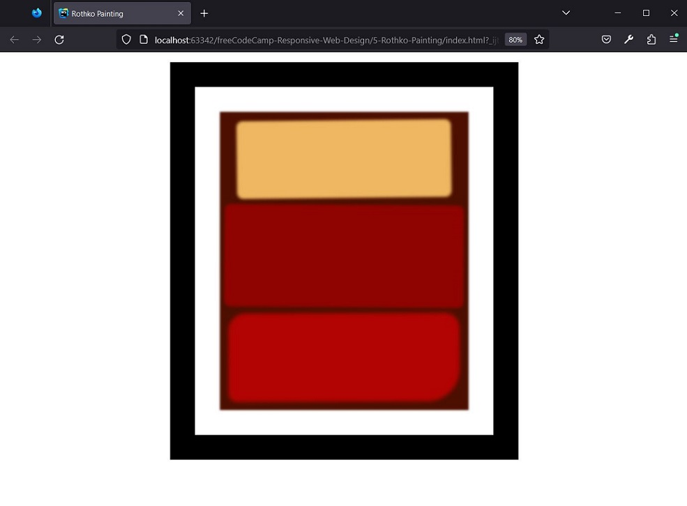

# freeCodeCamp - Design responsivo para a web - Aprenda o box model do CSS criando uma pintura de Rothko

## Resultado




## Passos

1. Agora, você já deve estar familiarizado com os elementos básicos que uma página em HTML deve ter.
Defina seu código com uma declaração DOCTYPE e com os elementos html (com o idioma definido para o inglês), head e body.
```
<!DOCTYPE html>
<html lang="en"></html>
```

2. Dentro do elemento head, adicione uma tag meta que define o charset como UTF-8 e um elemento title com o valor Rothko Painting.
Dentro do elemento body, adicione um elemento img com um src de `https://cdn.freecodecamp.org/curriculum/css-box-model/diagram-1.png`.
```
<head>
    <meta charset="UTF-8"/>
    <title>Rothko Painting</title>
</head>
<body>
    
</body>
```

3. No modelo de caixa do CSS, todos os elementos do HTML são tratados como uma caixa com quatro áreas.
Imagine que você recebeu uma caixa de sua loja on-line favorita -- o conteúdo é o item na caixa, ou, no nosso caso, 
um elemento de cabeçalho, de parágrafo ou de imagem.
Altere o atributo src na `` de `https://cdn.freecodecamp.org/curriculum/css-box-model/diagram-1.png` 
para `https://cdn.freecodecamp.org/curriculum/css-box-model/diagram-2.png`.
```

```

4. O conteúdo é cercado por um espaço chamado preenchimento (padding), do mesmo modo que um plástico de 
bolha separa um item da caixa ao seu redor.
Pense na borda como a caixa em que o item foi enviado.
Altere o atributo src para `https://cdn.freecodecamp.org/curriculum/css-box-model/diagram-3.png`
```

```

5. A margem é a área fora da caixa e pode ser usada para controlar o espaço entre outras caixas ou elementos.
Aqui, o elemento inferior tem uma margem superior maior, empurrando-o mais para baixo na página.
Agora que você entende o modelo da caixa do CSS, vamos começar a trabalhar na pintura de Rothko.
Remova o elemento ``.

6. Adicione um elemento div ao body.
Defina o atributo class como canvas.
Esse elemento atuará como a tela para sua pintura.
```
<div class="canvas"></div>
```

7. Antes de começar a estilizar a div que você adicionou, você precisa vincular o CSS ao HTML.
Adicione um elemento link para vincular o arquivo styles.css. Defina o href como styles.css 
e lembre-se de definir o atributo rel como stylesheet.
```
 <link type="text/css" rel="stylesheet" href="styles.css"/>
```

8. Mesmo que a <div> não tenha texto, ela ainda é tratada como uma caixa com conteúdo. 
Escreva uma nova regra de CSS que use o seletor .canvas e defina a width como 500 pixels. 
Aqui está uma regra de CSS que define a largura da classe card como 300 pixels:
```
.card {
  width: 300px;
}
```
```
.canvas {
    width: 500px;
}
```

9. Adicione a propriedade height com o valor de 600px à regra .canvas.
```
.canvas {
    width: 500px;
    height: 600px;
}
```

10. Altere a background-color da tela para #4d0f00.
```
.canvas {
    width: 500px;
    height: 600px;
    background-color: #4d0f00;
}
```

11. Toda pintura precisa de uma moldura.
Envolva o elemento .canvas em outra div. 
Dê à div a classe frame.
```
<div class="frame">
    <div class="canvas"></div>
</div>
```

12. Escreva uma nova regra usando o seletor de classe .frame.
Use a declaração abreviada de border para dar ao elemento .frame uma borda sólida e preta com uma largura de 50px.
```
.frame {
    border: solid black 50px;
}
```

13. O quadro é muito largo.
No seletor .frame, defina a width como 500 pixels.
```
.frame {
    border: solid black 50px;
    width: 500px;
}
```

14. Use o preenchimento (padding) para ajustar o espaçamento dentro de um elemento.
Em .frame, use a propriedade abreviada padding para aumentar o espaço entre os elementos .frame e .canvas em 50px. 
A propriedade abreviada aumentará o espaço acima, abaixo, na esquerda e na direita da borda do elemento e da tela 
dentro dele.
```
.frame {
    border: solid black 50px;
    width: 500px;
    padding: 50px;
}
```

15. Use margens para ajustar o espaçamento fora de um elemento.
Usando a propriedade margin, dê ao elemento .frame uma margem vertical de 20px e uma margem horizontal de auto. 
Isso moverá o frame para baixo 20 pixels e o centralizará na página na horizontal.
```
.frame {
    border: solid black 50px;
    width: 500px;
    padding: 50px;
    margin: 20px auto;
}
```

16. Adicione um novo elemento div abaixo do elemento .canvas.
Dê ao novo elemento div o atributo class com o valor de one. Esse será o seu primeiro retângulo.
```
<div class="one"></div>
```

17. Escreva uma nova regra que tenha como destino .one e defina sua width como 425 pixels.
```
.one {
    width: 425px;
}
```

18. Agora defina a height para .one como 150 pixels.
```
.one {
    width: 425px;
    height: 150px;
}
```

19. Defina a background-color do elemento .one como #efb762.
```
.one {
    width: 425px;
    height: 150px;
    background-color: #efb762;
}
```

20. Use margens para posicionar o elemento .one na tela.
Adicione a propriedade abreviada margin com uma margem vertical de 20px e uma margem horizontal de auto.
```
.one {
    width: 425px;
    height: 150px;
    background-color: #efb762;
    margin: 20px auto;
}
```

21. Agora .one está centralizado na horizontal, mas sua margem superior está passando os limites da tela 
e entrando na borda do quadro, deslocando a tela inteira 20 pixels para baixo.
Adicione um padding de 1px para o elemento .canvas para dar ao elemento .one algo sólido como barreira.
```
.canvas {
    width: 500px;
    height: 600px;
    background-color: #4d0f00;
    padding: 1px;
}
```

22. A adição de 1 pixel de preenchimento às partes superior, inferior, esquerda e direita da tela mudou suas dimensões 
para 502 pixels x 602 pixels.
Substitua a propriedade padding com overflow definido como hidden - o que faz com que a tela volte às dimensões originais.
```
.canvas {
    width: 500px;
    height: 600px;
    background-color: #4d0f00;
    overflow: hidden;
}
```

23. Adicione outra div com class tendo o valor two logo abaixo do seu elemento one. Este será seu segundo retângulo.
```
<div class="two"></div>
```

24. Crie uma regra de CSS que use o seletor .two e defina a width como 475 pixels.
```
.two {
    width: 475px;
}
```

25. Defina a height do elemento .two como 200 pixels.
```
.two {
    width: 475px;
    height: 200px;
}
```

26. Defina a background-color do elemento .two como #8f0401.
```
.two {
    width: 475px;
    height: 200px;
    background-color: #8f0401;
}
```

27. Centralize o elemento .two definindo a margin como auto.
```
.two {
    width: 475px;
    height: 200px;
    background-color: #8f0401;
    margin: auto;
}
```

28. Crie uma div com a class tendo o valor de three logo abaixo do elemento .two. Este será o seu terceiro retângulo.
```
<div class="three"></div>
```

29. Você não precisa usar sempre pixels ao dimensionar um elemento.
Crie uma nova regra, .three, e defina sua width para 91%.
```
.three {
    width: 91%;
}
```

30. Defina a height de .three como 28%.
```
.three {
    width: 91%;
    height: 28%;
}
```

31. Altere a background-color do elemento .three para #b20403.
```
.three {
    width: 91%;
    height: 28%;
    background-color: #b20403;
}
```

32. Centralize o elemento .three na tela definindo a margin como auto.
```
.three {
    width: 91%;
    height: 28%;
    background-color: #b20403;
    margin: auto;
}
```

33. É útil fazer com que suas margens empurrem em uma determinada direção.
Neste caso, a margem inferior do elemento .one empurra .two 20 pixels para baixo.
No seletor .two, use a propriedade abreviada margin para definir a margem superior como 0, 
a margem horizontal como auto e a margem inferior como 20px. 
Isso removerá a margem superior, centralizará o elemento na horizontal e definirá a margem inferior como 20 pixels.
```
.two {
    width: 475px;
    height: 200px;
    background-color: #8f0401;
    margin: 0 auto 20px;
}
```

34. As cores e formas da pintura são muito precisas para fingir que ela é uma pintura de Rothko.
Use a propriedade filter para dar um desfoque com blur na pintura de 2px no elemento .canvas.
Aqui está um exemplo de uma regra que adiciona um desfoque (blur) de 3px:
```
p {
    filter: blur(3px);
}
```
```
.canvas {
    width: 500px;
    height: 600px;
    background-color: #4d0f00;
    overflow: hidden;
    filter: blur(2px);
}
```

35. Crie uma regra que tenha como destino .one e .two e aumente o efeito de blur para 1 pixel.
```
.one, .two {
    filter: blur(1px);
}
```

36. Aumente o valor de blur de .three em 2 pixels.
```
.three {
    width: 91%;
    height: 28%;
    background-color: #b20403;
    margin: auto;
    filter: blur(2px);
}
```

37. Os retângulos são pequenos demais e suas bordas não possuem uma qualidade suave de pintura.
Aumente a área e suavize as bordas de .one definindo sua box-shadow como 0 0 3px 3px #efb762.
```
.one {
    width: 425px;
    height: 150px;
    background-color: #efb762;
    margin: 20px auto;
    box-shadow: 0 0 3px 3px #efb762;
}
```

38. Use a mesma declaração de box-shadow para .two, mas altere a cor de #efb762 para #8f0401.
```
.two {
    width: 475px;
    height: 200px;
    background-color: #8f0401;
    margin: 0 auto 20px;
    box-shadow: 0 0 3px 3px #8f0401;
}
```

39. Adicione uma box-shadow a .three com os valores 0 0 5px 5px #b20403.
```
.three {
    width: 91%;
    height: 28%;
    background-color: #b20403;
    margin: auto;
    filter: blur(2px);
    box-shadow: 0 0 5px 5px #b20403;
}
```

40. Os cantos de cada retângulo ainda estão muito pontiagudos.
Arredonde cada canto do elemento .one em 9 pixels usando a propriedade border-radius.
```
.one {
    width: 425px;
    height: 150px;
    background-color: #efb762;
    margin: 20px auto;
    box-shadow: 0 0 3px 3px #efb762;
    border-radius: 9px;
}
```

41. Use a propriedade border-radius no seletor .two para definir os raios superior esquerdo e inferior direito como 8px 
e os raios do canto superior direito e inferior esquerdo como 10px.
```
.two {
    width: 475px;
    height: 200px;
    background-color: #8f0401;
    margin: 0 auto 20px;
    box-shadow: 0 0 3px 3px #8f0401;
    border-radius: 8px 10px;
}
```

42. A propriedade border-radius aceita até quatro valores para arredondar os cantos superior esquerdo, 
superior direito, inferior direito e inferior esquerdo.
Arredonde o canto superior esquerdo de .three em 30 pixels, o canto superior direito em 25 pixels, 
o canto inferior direito em 60 pixels e o canto inferior esquerdo em 12 pixels.
```
.three {
    width: 91%;
    height: 28%;
    background-color: #b20403;
    margin: auto;
    filter: blur(2px);
    box-shadow: 0 0 5px 5px #b20403;
    border-radius: 30px 25px 60px 12px;
}
```

43. Gire todos os retângulos para dar a eles mais um visual imperfeito, como se fosse pintado à mão.
Use a propriedade transform no seletor .one com o valor rotate para girar o elemento no sentido anti-horário em 0,6 graus.
```
.one {
    width: 425px;
    height: 150px;
    background-color: #efb762;
    margin: 20px auto;
    box-shadow: 0 0 3px 3px #efb762;
    border-radius: 9px;
    transform: rotate(-0.6deg);
}
```

44. Gire o elemento .two no sentido horário em 0,4 graus.
```
.two {
    width: 475px;
    height: 200px;
    background-color: #8f0401;
    margin: 0 auto 20px;
    box-shadow: 0 0 3px 3px #8f0401;
    border-radius: 8px 10px;
    transform: rotate(0.4deg);
}
```

45. Gire .three no sentido anti-horário em 0,2 graus.
Com este último passo, a pintura Rothko está completa.
```
.three {
    width: 91%;
    height: 28%;
    background-color: #b20403;
    margin: auto;
    filter: blur(2px);
    box-shadow: 0 0 5px 5px #b20403;
    border-radius: 30px 25px 60px 12px;
    transform: rotate(-0.2deg);
}
```


## Referências
https://www.freecodecamp.org/learn/2022/responsive-web-design/learn-the-css-box-model-by-building-a-rothko-painting/
, acessado em 05/11/2023.