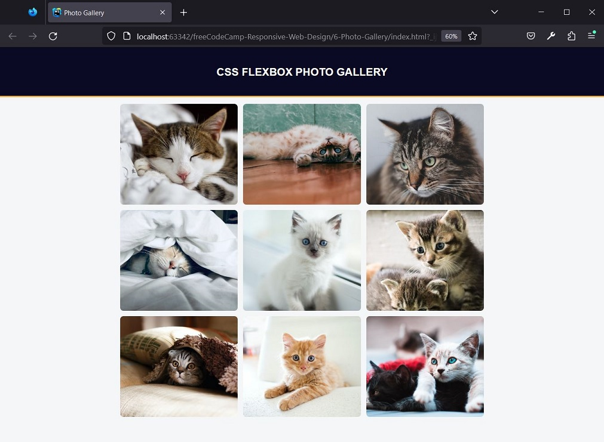

# freeCodeCamp - Design responsivo para a web - Aprenda CSS Flexbox criando uma galeria de fotos

## Resultado




## Passos

1. Comece com o boilerplate padrão do HTML. 
Adicione a declaração DOCTYPE e os elementos html, head e body.
Adicione o atributo lang à tag de abertura de <html> com en definido como o valor.
```
<!DOCTYPE html>
<html lang="en">
    <head>
    </head>
    <body>
    </body>
</html>
```

2. Dentro de seu elemento head, adicione uma tag meta com name definido como viewport e content definido 
como `width=device-width, initial-scale=1`.
Adicione também uma tag meta com charset definido como `UTF-8`.
```
<meta charset="UTF-8"/>
<meta name="viewport" content="width=device-width, initial-scale=1"/>
```

3. Dentro do elemento head, adicione um elemento title com o texto definido como Photo Gallery 
e um elemento link para adicionar seu arquivo styles.css à página.
```
<title>Photo Gallery</title>
<link type="text/css" rel="stylesheet" href="./styles.css"/>
```

4. Adicione um elemento header dentro do elemento body e atribua a ele uma classe header.
Dentro de header, crie um h1 com o texto css flexbox photo gallery.
```
<header class="header">
    <h1>css flexbox photo gallery</h1>
</header>
```

5. Abaixo do elemento .header, crie outro elemento div e atribua a ele uma class de gallery.
Essa div atuará como um contêiner para as imagens da galeria.
Dentro de .gallery, crie nove elementos img.
```
        <div class="gallery">
            
            
            
            
            
            
            
            
            
        </div>
```

6. Em seguida, dê a cada img um atributo src de acordo com sua ordem no documento. 
A primeira img deve ter para o atributo src o valor de `https://cdn.freecodecamp.org/curriculum/css-photo-gallery/1.jpg`. 
O resto deve ser o mesmo, porém substituindo o 1 pelo número da img na sequência em que está no documento.
```
        <div class="gallery">
            
            
            
            
            
            
            
            
            
        </div>
```

7. Para visualizar melhor o tamanho dos elementos, pode ser útil adicionar uma borda.
Dê ao elemento .gallery uma width de 50% e uma border de 5px solid red.
Em seguida, dê ao elemento img uma width de 100%, um padding de 5px e uma border de 5px solid blue.
```
.gallery {
    width: 50%;
    border: 5px solid red;
}

img {
    width: 100%;
    padding: 5px;
    border: 5px solid blue;
}
```

8. Observe como a borda azul da imagem se estende para além da borda vermelha da galeria. 
Isto é devido ao modo como os navegadores calculam o tamanho dos elementos do contêiner.
A propriedade box-sizing é usada para definir esse comportamento. 
Por padrão, o modelo content-box é usado. 
Com esse modelo, quando um elemento tem uma largura específica, essa largura é calculada apenas com base no conteúdo do elemento. 
Os valores de preenchimento e das bordas são adicionados à largura total. 
Assim, o elemento cresce para acomodar esses valores.
Tente definir o box-sizing para content-box explicitamente, com o seletor global *. 
Nesse ponto, você não verá nenhuma mudança, porque você está usando o valor padrão.
```
* {
    box-sizing: content-box;
}
```

9. O modelo de dimensionamento border-box faz o oposto de content-box. 
A largura total do elemento, incluindo preenchimento e borda, será o conjunto de largura explícita. 
O conteúdo do elemento encolherá para dar espaço ao preenchimento e à borda.
Altere a propriedade box-sizing para border-box. 
Observe como a borda azul da imagem se ajusta dentro da borda vermelha da galeria.
```
* {
    box-sizing: border-box;
}
```

10. Agora que você descobriu a abordagem usando box-sizing, você pode limpar o CSS que adicionou para ver as alterações.
Remova os seletores .gallery e img, bem como todas as regras que existem.

11. Agora, as imagens estão muito grandes.
Crie um seletor .gallery img para localizar suas imagens. 
Dê a todas elas uma width de 100% e uma max-width de 350px.
Também defina a propriedade height para 300px para manter suas imagens com um tamanho uniforme.
```
.gallery img {
    width: 100%;
    max-width: 350px;
    height: 300px;
}
```

12. Remova a margem do elemento body, 
defina font-family como sans-serif 
e dê a ela uma background-color com o valor de #f5f6f7.
```
body {
    margin: 0;
    font-family: sans-serif;
    background-color: #f5f6f7;
}
```

13. Alinhe o texto de .header no centro. 
Torne o texto maiúsculo usando a propriedade text-transform com uppercase como valor.
Dê a ele um espaçamento de 32px em todos os lados. 
Defina os valores de cor do fundo como #0a0a23 e do texto como #fff.
Adicione uma border-bottom com o valor de 4px solid #fdb347.
```
.header {
    text-align: center;
    text-transform: uppercase;
    padding: 32px;
    background-color: #0a0a23;
    color: #fff;
    border-bottom: 4px solid #fdb347;
}
```

14. Flexbox é um layout de CSS unidimensional que pode controlar a forma como os itens 
são espaçados e alinhados dentro de um contêiner.
Para usá-lo, dê a um elemento uma propriedade display de flex. 
Isto fará do elemento um contêiner flex. 
Todos os filhos direto de um contêiner flex são chamados de itens flex.
Crie um seletor .gallery e torne-o um contêiner flex.
```
.gallery {
    display: flex;
}
```

15. O Flexbox tem um eixo principal e um eixo cruzado. 

O eixo principal é definido pela propriedade flex-direction, que tem quatro valores possíveis:
- row (padrão): eixo horizontal com os itens flex items da esquerda para a direita
- row-reverse: eixo horizontal com os itens flex da direita para a esquerda
- column: eixo vertical com os itens flex de cima para baixo
- column-reverse: eixo vertical com os itens flex de baixo para cima

- Observação: os eixos e direções serão diferentes, dependendo da direção do texto. 
Os valores mostrados são para uma direção de texto da esquerda para a direita.
Experimente os diferentes valores para ver como eles afetam o layout.
Quando estiver pronto, defina explicitamente uma flex-direction de row no elemento .gallery.
```
.gallery {
    display: flex;
    flex-direction: row;
}
```

16. A propriedade flex-wrap determina como os itens flex se comportam quando o contêiner flex for muito pequeno. 
Defini-la como wrap permitirá que os itens sejam associados à próxima linha ou coluna. nowrap (padrão) 
impedirá que os itens sejam associados ou que encolham, se necessário.
Faça com que seus itens flex sejam associados à próxima linha quando eles ficarem sem espaço.
```
.gallery {
    display: flex;
    flex-direction: row;
    flex-wrap: wrap;
}
```

17. A propriedade justify-content determina como os itens dentro de um contêiner flex são posicionados no eixo principal, 
afetando a posição e o espaço ao seu redor.
Dê ao seletor .gallery a propriedade justify-content com o valor de center.
```
.gallery {
    display: flex;
    flex-direction: row;
    flex-wrap: wrap;
    justify-content: center;
}
```

18. A propriedade align-items posiciona o conteúdo do flex ao longo do eixo transversal. 
Neste caso, com flex-direction definido como row, o eixo cruzado seria vertical.
Para centralizar as imagens na vertical, dê ao seletor .gallery uma propriedade align-items definida como center.
```
.gallery {
    display: flex;
    flex-direction: row;
    flex-wrap: wrap;
    justify-content: center;
    align-items: center;
}
```

19. Dê ao seletor .gallery uma propriedade padding definida como 20px 10px para criar algum espaço em torno do contêiner.
Então, dê a ele uma max-width de 1400px e adicione uma margin de 0 auto para centralizá-la.
```
.gallery {
    display: flex;
    flex-direction: row;
    flex-wrap: wrap;
    justify-content: center;
    align-items: center;
    padding: 20px 10px;
    max-width: 1400px;
    margin: 0 auto;
}
```

20. Observe como algumas de suas imagens ficaram distorcidas. Isto ocorre porque as imagens têm proporções diferentes. 
Em vez de definir cada proporção individualmente, você pode usar a propriedade object-fit para determinar como as imagens devem se comportar.
Dê ao seletor .gallery img a propriedade object-fit com o valor cover. 
Isto informará a imagem que ela deve preencher o contêiner img enquanto mantém a proporção, resultando em um corte para o ajuste.
```
.gallery img {
    width: 100%;
    max-width: 350px;
    height: 300px;
    object-fit: cover;
}
```

21. Suas imagens precisam de espaço entre elas.
A propriedade abreviada gap do CSS define as lacunas (gaps), também conhecidas como calhas, entre as linhas e as colunas. 
A propriedade gap e suas subpropriedades row-gap e column-gap fornecem essa funcionalidade para layouts flex, grid e multicolunas. 
Você aplica a propriedade ao elemento contêiner.
Dê ao seu contêiner flex .gallery uma propriedade gap com o valor 16px.
```
.gallery {
    display: flex;
    flex-direction: row;
    flex-wrap: wrap;
    justify-content: center;
    align-items: center;
    padding: 20px 10px;
    max-width: 1400px;
    margin: 0 auto;
    gap: 16px;
}
```

22. Suavize as imagens um pouco dando ao seletor .gallery img uma propriedade border-radius de 10px.
```
.gallery img {
    width: 100%;
    max-width: 350px;
    height: 300px;
    object-fit: cover;
    border-radius: 10px;
}
```

23. O pseudoelemento ::after cria um elemento que é o último filho do elemento selecionado. 
Você pode usá-lo para adicionar um elemento vazio após a última imagem. 
Se você der a esse elemento a mesma width das imagens, ele empurrará a última imagem para a esquerda quando a galeria estiver em um layout de duas colunas. 
Neste momento, ele está no centro porque você definiu justify-content: center no contêiner flex.
```
.container::after {
  content: "";
  width: 860px;
}
```
Crie um novo seletor usando um pseudoelemento ::after no elemento .gallery. 
Adicione uma propriedade content definida como uma string vazia "" e defina 350px como o valor da propriedade width.
```
.gallery::after {
    content: "";
    width: 350px;
}
```

24. O atributo alt da imagem deve descrever o conteúdo da imagem. 
Leitores de tela anunciam o texto alternativo no lugar das imagens. 
Se a imagem não puder ser carregada, esse texto é apresentado no lugar da imagem.
Para completar o projeto, adicione um atributo alt a todas as nove imagens de gatos para descrevê-las. 
Use um valor de pelo menos 5 caracteres de tamanho para cada um.
```
<div class="gallery">
    
    
    
    
    
    
    
    
    
</div>
```


## Referências
https://www.freecodecamp.org/portuguese/learn/2022/responsive-web-design/learn-css-flexbox-by-building-a-photo-gallery/
, acessado em 06/11/2023.