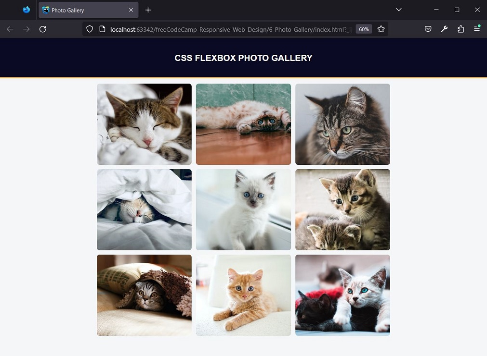

# freeCodeCamp - Responsive Web Design - Learn CSS Flexbox by Building a Photo Gallery

## Result



## Steps

1. Start with the default HTML boilerplate.
   Add the DOCTYPE declaration and the html, head and body elements.
   Add the lang attribute to the opening <html> tag with en set as the value.
```
<!DOCTYPE html>
<html lang="en">
     <head>
     </head>
     <body>
     </body>
</html>
```

2. Inside your head element, add a meta tag with name set to viewport and content set
   like `width=device-width, initial-scale=1`.
   Also add a meta tag with charset set to `UTF-8`.
```
<meta charset="UTF-8"/>
<meta name="viewport" content="width=device-width, initial-scale=1"/>
```

3. Inside the head element, add a title element with the text set to Photo Gallery
   and a link element to add your styles.css file to the page.
```
<title>Photo Gallery</title>
<link type="text/css" rel="stylesheet" href="./styles.css"/>
```

4. Add a header element inside the body element and assign it a header class.
   Inside the header, create an h1 with the text css flexbox photo gallery.
```
<header class="header">
     <h1>css flexbox photo gallery</h1>
</header>
```

5. Below the .header element, create another div element and give it a gallery class.
   This div will act as a container for the gallery images.
   Inside .gallery, create nine img elements.
```
         <div class="gallery">
             
             
             
             
             
             
             
             
             
         </div>
```

6. Then give each img a src attribute according to its order in the document.
   The first img must have the value of `https://cdn.freecodecamp.org/curriculum/css-photo-gallery/1.jpg` for the src attribute.
   The rest must be the same, but replacing the 1 with the image number in the sequence in which it is in the document.
```
         <div class="gallery">
             
             
             
             
             
             
             
             
             
         </div>
```

7. To better visualize the size of the elements, it may be useful to add a border.
   Give the .gallery element a width of 50% and a border of 5px solid red.
   Next, give the img element a width of 100%, a padding of 5px and a border of 5px solid blue.
```
.gallery {
     width: 50%;
     border: 5px solid red;
}

img {
     width: 100%;
     padding: 5px;
     border: 5px solid blue;
}
```

8. Notice how the blue border of the image extends beyond the red border of the gallery.
   This is due to the way browsers calculate the size of container elements.
   The box-sizing property is used to define this behavior.
   By default, the content-box template is used.
   With this model, when an element has a specific width, that width is calculated solely based on the element's content.
   Padding and border values are added to the total width.
   Thus, the element grows to accommodate these values.
   Try setting the box-sizing to content-box explicitly, with the global * selector.
   At this point, you won't see any changes because you are using the default value.
```
* {
     box-sizing: content-box;
}
```

9. The border-box sizing model does the opposite of content-box.
   The total width of the element, including padding and border, will be the explicit width set.
   The element's content will shrink to make room for the padding and border.
   Change the box-sizing property to border-box.
   Notice how the blue border of the image fits inside the red border of the gallery.
```
* {
     box-sizing: border-box;
}
```

10. Now that you've figured out the approach using box-sizing, you can clean up the CSS you added to see the changes.
    Remove the .gallery and img selectors as well as any rules that exist.

11. Now the images are too big.
    Create a .gallery img selector to find your images.
    Give them all a width of 100% and a max-width of 350px.
    Also set the height property to 300px to keep your images a uniform size.
```
.gallery img {
     width: 100%;
     max-width: 350px;
     height: 300px;
}
```

12. Remove the margin from the body element,
    set font-family to sans-serif
    and give it a background-color with the value of #f5f6f7.
```
body {
     margin: 0;
     font-family: sans-serif;
     background-color: #f5f6f7;
}
```

13. Center align the .header text.
    Make the text uppercase using the text-transform property with uppercase as the value.
    Give it 32px spacing on all sides.
    Set the background color values to #0a0a23 and the text color values to #fff.
    Add a border-bottom with a value of 4px solid #fdb347.
```
.header {
     text-align: center;
     text-transform: uppercase;
     padding: 32px;
     background-color: #0a0a23;
     color: #fff;
     border-bottom: 4px solid #fdb347;
}
```

14. Flexbox is a one-dimensional CSS layout that can control the way items
    are spaced and aligned within a container.
    To use it, give an element a display property of flex.
    This will make the element a flex container.
    All direct children of a flex container are called flex items.
    Create a .gallery selector and make it a flex container.
```
.gallery {
     display: flex;
}
```

15. The Flexbox has a main axis and a cross axis.

The main axis is defined by the flex-direction property, which has four possible values:
- row (default): horizontal axis with flex items from left to right
- row-reverse: horizontal axis with flex items from right to left
- column: vertical axis with flex items from top to bottom
- column-reverse: vertical axis with flex items from bottom to top

- Note: the axes and directions will be different depending on the direction of the text.
  The values shown are for a left-to-right text direction.
  Experiment with the different values to see how they affect the layout.
  When you're ready, explicitly set a row flex-direction on the .gallery element.
```
.gallery {
     display: flex;
     flex-direction: row;
}
```

16. The flex-wrap property determines how flex items behave when the flex container is too small.
    Setting it to wrap will allow items to be bound to the next row or column. nowrap (default)
    will prevent items from binding or shrinking if necessary.
    Have your flex items be associated with the next row when they run out of space.
```
.gallery {
     display: flex;
     flex-direction: row;
     flex-wrap: wrap;
}
```

17. The justify-content property determines how items within a flex container are positioned on the main axis,
    affecting the position and space around you.
    Give the .gallery selector the justify-content property with the value of center.
```
.gallery {
     display: flex;
     flex-direction: row;
     flex-wrap: wrap;
     justify-content: center;
}
```

18. The align-items property positions the flex content along the transverse axis.
    In this case, with flex-direction set to row, the cross axis would be vertical.
    To center images vertically, give the .gallery selector an align-items property set to center.
```
.gallery {
     display: flex;
     flex-direction: row;
     flex-wrap: wrap;
     justify-content: center;
     align-items: center;
}
```

19. Give the .gallery selector a padding property set to 20px 10px to create some space around the container.
    So, give it a max-width of 1400px and add a margin of 0 auto to center it.
```
.gallery {
     display: flex;
     flex-direction: row;
     flex-wrap: wrap;
     justify-content: center;
     align-items: center;
     padding: 20px 10px;
     max-width: 1400px;
     margin: 0 auto;
}
```

20. Notice how distorted some of your images have become. This is because the images have different proportions.
    Instead of setting each aspect ratio individually, you can use the object-fit property to determine how images should behave.
    Give the .gallery img selector the object-fit property with the value cover.
    This will tell the image that it should fill the img container while maintaining the aspect ratio, resulting in a crop to fit.
```
.gallery img {
     width: 100%;
     max-width: 350px;
     height: 300px;
     object-fit: cover;
}
```

21. Your images need space between them.
    The CSS gap shorthand property defines the gaps, also known as gutters, between rows and columns.
    The gap property and its row-gap and column-gap subproperties provide this functionality for flex, grid, and multicolumn layouts.
    You apply the property to the containing element.
    Give your flex .gallery container a gap property with the value 16px.
```
.gallery {
     display: flex;
     flex-direction: row;
     flex-wrap: wrap;
     justify-content: center;
     align-items: center;
     padding: 20px 10px;
     max-width: 1400px;
     margin: 0 auto;
     gap: 16px;
}
```

22. Soften the images a bit by giving the .gallery img selector a border-radius property of 10px.
```
.gallery img {
     width: 100%;
     max-width: 350px;
     height: 300px;
     object-fit: cover;
     border-radius: 10px;
}
```

23. The ::after pseudo-element creates an element that is the last child of the selected element.
    You can use it to add an empty element after the last image.
    If you give this element the same width as the images, it will push the last image to the left when the gallery is in a two-column layout.
    Right now it is in the center because you set justify-content: center in the flex container.
```
.container::after {
   content: "";
   width: 860px;
}
```
Create a new selector using a ::after pseudo-element in the .gallery element.
Add a content property set to an empty string "" and set 350px as the width property value.
```
.gallery::after {
     content: "";
     width: 350px;
}
```

24. The alt attribute of the image must describe the content of the image.
    Screen readers announce alt text in place of images.
    If the image cannot be loaded, this text is displayed in place of the image.
    To complete the project, add an alt attribute to all nine cat images to describe them.
    Use a value of at least 5 characters in length for each.
```
<div class="gallery">
     
     
     
     
     
     
     
     
     
</div>
```


## References
https://www.freecodecamp.org/learn/2022/responsive-web-design/learn-css-flexbox-by-building-a-photo-gallery/
, accessed on 11/06/2023.