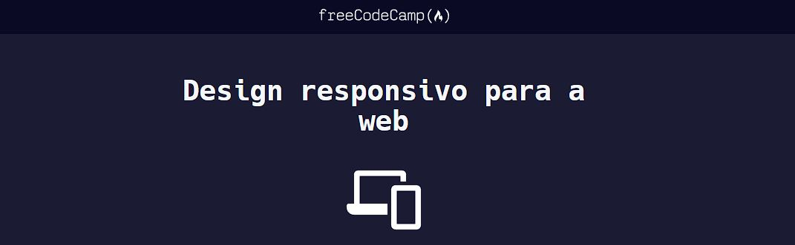

# freeCodeCamp - Design responsivo para a web

## Projetos
    1 - Cat Photo App (Aprenda HTML criando um aplicativo de fotos de gatos)
    2 - Cafe Menu (Aprenda CSS básico criando um menu de restaurante)
    4 - Registration Form (Aprenda formulários em HTML criando um formulário de registro)
    5 - Rothko Painting (Aprenda o box model do CSS criando uma pintura de Rothko)
    6 - Photo Gallery (Aprenda CSS Flexbox criando uma galeria de fotos)
    11- Piano (Aprenda design responsivo para a web criando um piano)

## Referências
https://www.freecodecamp.org/portuguese/learn/2022/responsive-web-design
, acessado em 05/11/2023.