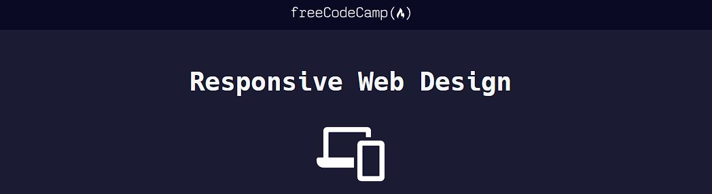

# freeCodeCamp - Responsive Web Design

## Projects
    2 - Cafe Menu (Learn Basic CSS by Building a Cafe Menu)
    4 - Registration Form (Learn HTML Forms by Creating a Registration Form)

## References
https://www.freecodecamp.org/learn/2022/responsive-web-design/
, accessed on 10/15/2023.